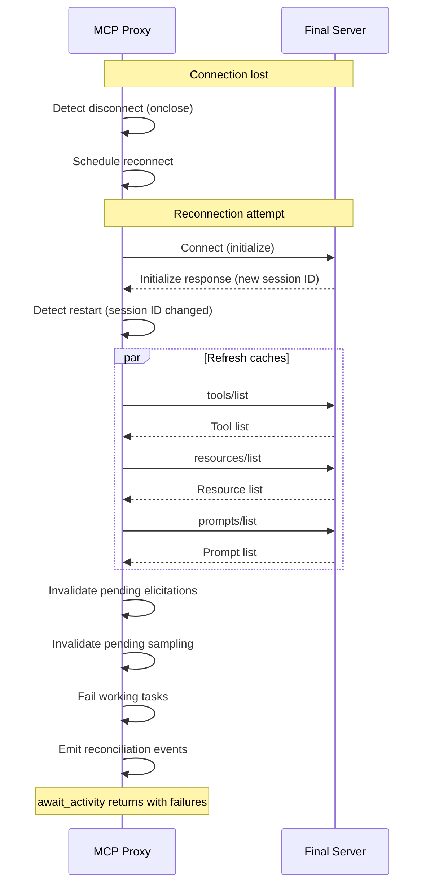

# Improving Code Factoring Plan

> **Status**: This refactoring plan has been implemented. The document is retained for historical reference.
> The `registry.ts` file mentioned below has been replaced by the `session/` and `state/` modules.

This document outlines a plan to refactor the mcp-proxy codebase to support the new task-based tool execution model described in `TASKS_AND_ELICITATIONS.md` while maintaining clean separation of concerns and avoiding race conditions.

**Related Documents:**
- `TASKS_AND_ELICITATIONS.md` - Task promotion, elicitation handling, tool execution model
- `SESSION_STATE_DESIGN.md` - Session state categories, event delivery semantics, response structure

## Current State Analysis

### Current File Structure

```
src/
├── server.ts    # 637 lines - HTTP server + ALL tool handlers
├── client.ts    # 478 lines - MCPHttpClient wrapper
├── registry.ts  # 605 lines - ServerRegistry with buffer management
└── types.ts     # 216 lines - Type definitions
```

### Current Problems

1. **`server.ts` is a monolith** - Contains HTTP setup, session management, AND all 14 tool handlers in one function
2. **Mixed concerns in `registry.ts`** - Client management, buffer storage, and request handling all interleaved
3. **No event system** - Callbacks are used directly, making `await_activity` difficult to implement
4. **Race condition potential** - Buffers are modified in callbacks without synchronization primitives
5. **No task management infrastructure** - Need to add timeout-based task promotion

### New Requirements

From `TASKS_AND_ELICITATIONS.md`:
- Timeout-based task promotion for `execute_tool`
- New tools: `list_tasks`, `get_task`, `get_task_result`, `cancel_task`, `await_activity`
- Per-server organization of events/pending items
- Event-driven `await_activity` with triggers, events, and pending state
- New resource: `emceepee://diagrams`

### New Dependencies

Add to `package.json`:
```json
{
  "dependencies": {
    "ulid": "^3.0.2"  // Time-sortable unique IDs for events, tasks, requests
  }
}
```

## Proposed Architecture

### New File Structure

```
src/
├── server.ts              # HTTP server setup only (~150 lines)
├── tools/
│   ├── index.ts           # Tool registration helper
│   ├── server-management.ts   # add_server, remove_server, list_servers
│   ├── tool-execution.ts      # list_tools, execute_tool (with timeout)
│   ├── resources.ts           # list_resources, read_resource
│   ├── prompts.ts             # list_prompts, get_prompt
│   ├── notifications.ts       # get_notifications, get_logs
│   ├── sampling.ts            # get_sampling_requests, respond_to_sampling
│   ├── elicitation.ts         # get_elicitations, respond_to_elicitation
│   ├── tasks.ts               # list_tasks, get_task, get_task_result, cancel_task
│   └── activity.ts            # await_activity
├── resources/
│   ├── index.ts           # Resource registration helper
│   └── diagrams.ts        # emceepee://diagrams resource
├── session/
│   ├── session-manager.ts     # SessionManager - creates/destroys sessions
│   ├── session-state.ts       # SessionState - per-session state container
│   └── server-config.ts       # ServerConfigRegistry - shared server configs
├── state/
│   ├── event-system.ts    # Unified event signaling + persistence (per-session)
│   ├── task-manager.ts    # ProxyTask lifecycle management (per-session)
│   ├── buffer-manager.ts  # Notifications, logs (per-session)
│   ├── pending-requests.ts # Elicitation & sampling request storage (per-session)
│   └── reconciliation.ts  # Server restart state reconciliation
├── client.ts              # MCPHttpClient (mostly unchanged)
└── types.ts               # All type definitions (expanded)
```

## Detailed Design

### 1. Per-Session Event System (`src/state/event-system.ts`)

**Architectural Decision**: Each session gets its own `EventSystem` instance. This is the natural design because:
- Each session has its own backend connections (elicitations route to the owning session)
- Each session has its own SSE stream (replay only needs that session's events)
- Session cleanup is simple (discard the whole EventSystem)
- No `streamId` tagging needed - all events belong to the session

**Note**: For complete event delivery semantics (exactly-once, SSE replay separation), see `SESSION_STATE_DESIGN.md`. This section covers the implementation details.

```typescript
import { EventEmitter } from "events";
import { ulid } from "ulid";

export type ProxyEventType =
  | "notification"
  // NOTE: "log" is intentionally NOT an event type. Logs are Category 2 (on-demand)
  // per SESSION_STATE_DESIGN.md and do NOT trigger await_activity.
  | "elicitation_request"
  | "elicitation_expired"
  | "sampling_request"
  | "sampling_expired"
  | "task_created"
  | "task_completed"
  | "task_failed"
  | "task_cancelled"
  | "task_expired"
  | "server_added"        // New server config added (by any session)
  | "server_removed"      // Server config removed (by any session)
  | "server_connected"    // Backend connection established (per-session)
  | "server_disconnected" // Backend connection lost (per-session)
  | "server_reconnected"; // Backend reconnected after disconnect (per-session)

export interface StoredEvent {
  // Identity - ULID provides time-sortability and global uniqueness
  id: string;                    // ULID - time-sortable, globally unique

  // Timestamps
  createdAt: Date;
  sentAt?: Date;                 // When first sent to client (if ever)

  // Content
  type: ProxyEventType;
  server: string;
  data: unknown;
}

export interface EventSystemConfig {
  maxEvents: number;             // Default: 1000
  evictionWarningThreshold: number; // Warn when this % full, default: 0.8 (80%)
}

const DEFAULT_CONFIG: EventSystemConfig = {
  maxEvents: 1000,
  evictionWarningThreshold: 0.8,
};

export class EventSystem {
  private readonly emitter = new EventEmitter();
  private readonly events: StoredEvent[] = [];
  private readonly config: EventSystemConfig;

  // Track last delivered event ID (for "new" detection in await_activity)
  private lastDeliveredId: string | null = null;

  // For structured logging (see Logging section)
  private logger?: StructuredLogger;

  constructor(config: Partial<EventSystemConfig> = {}, logger?: StructuredLogger) {
    this.config = { ...DEFAULT_CONFIG, ...config };
    this.logger = logger;
  }

  /**
   * Add an event to the system.
   * 1. Persists to event store (for SSE replay)
   * 2. Signals waiters (for await_activity wakeup)
   * 3. Enforces storage limits with eviction
   */
  public addEvent(type: ProxyEventType, server: string, data: unknown): string {
    // Check limits and evict if necessary
    this.enforceStorageLimits();

    const id = ulid(); // Time-sortable, globally unique

    const event: StoredEvent = {
      id,
      createdAt: new Date(),
      type,
      server,
      data,
    };

    this.events.push(event);

    // Wake any await_activity waiters
    this.emitter.emit("event", event);

    return id;
  }

  /**
   * Wait for any event or timeout.
   * Used by await_activity to block until something happens.
   */
  public async waitForActivity(timeoutMs: number): Promise<StoredEvent | null> {
    return new Promise((resolve) => {
      const timer = setTimeout(() => {
        this.emitter.removeListener("event", handler);
        resolve(null); // timeout
      }, timeoutMs);

      const handler = (event: StoredEvent): void => {
        clearTimeout(timer);
        this.emitter.removeListener("event", handler);
        resolve(event);
      };

      this.emitter.once("event", handler);
    });
  }

  /**
   * Get events after a given cursor (Last-Event-ID).
   * Used for SSE replay. Does NOT update delivery tracking.
   */
  public getEventsAfter(lastEventId: string | null): StoredEvent[] {
    if (lastEventId === null) {
      return [...this.events];
    }

    const cursorIndex = this.events.findIndex(e => e.id === lastEventId);

    if (cursorIndex === -1) {
      // Cursor not found - client is too far behind or invalid ID
      this.logger?.warn("event_cursor_not_found", {
        lastEventId,
        action: "returning_all_events",
      });
      return [...this.events];
    }

    return this.events.slice(cursorIndex + 1);
  }

  /**
   * Get new events for tool responses (events not yet delivered).
   * Marks returned events as "delivered" by updating lastDeliveredId.
   */
  public getNewEvents(): StoredEvent[] {
    let newEvents: StoredEvent[];

    if (!this.lastDeliveredId) {
      // First call - return all events
      newEvents = [...this.events];
    } else {
      // Return events after the last delivered ID
      const lastIndex = this.events.findIndex(e => e.id === this.lastDeliveredId);
      if (lastIndex === -1) {
        // Last delivered ID no longer in store (evicted) - return all
        newEvents = [...this.events];
      } else {
        newEvents = this.events.slice(lastIndex + 1);
      }
    }

    // Update last delivered marker
    if (newEvents.length > 0) {
      const lastEvent = newEvents[newEvents.length - 1];
      if (lastEvent) {
        this.lastDeliveredId = lastEvent.id;
      }
    }

    return newEvents;
  }

  /**
   * Check if there are new events (without marking as delivered).
   */
  public hasNewEvents(): boolean {
    if (!this.lastDeliveredId) {
      return this.events.length > 0;
    }

    const lastIndex = this.events.findIndex(e => e.id === this.lastDeliveredId);
    if (lastIndex === -1) {
      return this.events.length > 0;
    }

    return lastIndex < this.events.length - 1;
  }

  /**
   * Mark an event as sent (for timestamp tracking).
   */
  public markSent(eventId: string): void {
    const event = this.events.find(e => e.id === eventId);
    if (event && !event.sentAt) {
      event.sentAt = new Date();
    }
  }

  /**
   * Check if any waiters are listening.
   */
  public hasWaiters(): boolean {
    return this.emitter.listenerCount("event") > 0;
  }

  /**
   * Get all events (for debugging/introspection).
   */
  public getAllEvents(): StoredEvent[] {
    return [...this.events];
  }

  /**
   * Get event count for monitoring.
   */
  public getEventCount(): number {
    return this.events.length;
  }

  /**
   * Enforce storage limits by evicting oldest events.
   * Logs warnings when thresholds are hit.
   */
  private enforceStorageLimits(): void {
    const count = this.events.length;

    // Check limit
    if (count >= this.config.maxEvents) {
      const evictCount = Math.ceil(this.config.maxEvents * 0.1); // Evict oldest 10%

      this.logger?.warn("event_limit_eviction", {
        evictedCount: evictCount,
        totalCount: count,
        maxEvents: this.config.maxEvents,
      });

      // Remove oldest events
      const evicted = this.events.splice(0, evictCount);

      // If lastDeliveredId was evicted, reset it to the oldest remaining event
      if (this.lastDeliveredId && evicted.some(e => e.id === this.lastDeliveredId)) {
        this.lastDeliveredId = this.events.length > 0 ? this.events[0]?.id ?? null : null;
      }
    }

    // Warn at threshold
    const warningThreshold = this.config.maxEvents * this.config.evictionWarningThreshold;
    if (count >= warningThreshold && count < this.config.maxEvents) {
      this.logger?.warn("event_store_approaching_limit", {
        totalCount: count,
        maxEvents: this.config.maxEvents,
        percentFull: Math.round((count / this.config.maxEvents) * 100),
      });
    }
  }
}
```

**Key design decisions:**
- **Per-session instances** - Each session owns its EventSystem, no streamId tagging needed
- **ULIDs for event IDs** - Time-sortable, globally unique, no counter synchronization needed
- **Single class** - Combines signaling and persistence in one place
- **Storage limits with eviction** - Prevents unbounded memory growth
- **Warning logs** - Alerts operators before limits are hit
- **Session cleanup is trivial** - Just discard the EventSystem instance
- **Exactly-once delivery** - Events tracked via `lastDeliveredId`, returned via `getNewEvents()`
- **Any tool response delivers events** - Not just `await_activity`, any tool response includes undelivered events

### 2. Task Manager (`src/state/task-manager.ts`)

Manages proxy task lifecycle, including timeout-based promotion.

```typescript
import { ulid } from "ulid";
import type { CallToolResult } from "@modelcontextprotocol/sdk/types.js";
import type { EventSystem } from "./event-system.js";

export interface ProxyTask {
  taskId: string;  // ULID - time-sortable, globally unique
  createdAt: Date;
  lastUpdatedAt: Date;
  server: string;
  toolName: string;
  toolArgs: Record<string, unknown>;
  status: ProxyTaskStatus;
  statusMessage?: string;
  result?: CallToolResult;
  error?: string;
  ttl: number;
  // Internal: cleanup timer handle (not exposed in API responses)
  _cleanupTimeoutHandle?: NodeJS.Timeout;
}

export type ProxyTaskStatus = "working" | "completed" | "failed" | "cancelled" | "expired";

export interface TaskManagerConfig {
  defaultTtlMs: number;          // Default: 5 minutes (300000)
  maxTtlMs: number;              // Default: 30 minutes (1800000)
  cleanupIntervalMs: number;     // Default: 1 minute (60000)
  completedRetentionMs: number;  // Default: 5 minutes (300000)
}

const DEFAULT_CONFIG: TaskManagerConfig = {
  defaultTtlMs: 300_000,        // 5 minutes
  maxTtlMs: 1_800_000,          // 30 minutes
  cleanupIntervalMs: 60_000,    // 1 minute
  completedRetentionMs: 300_000, // 5 minutes
};

export class TaskManager {
  private readonly tasks = new Map<string, ProxyTask>();
  private readonly eventSystem: EventSystem;
  private readonly config: TaskManagerConfig;
  private cleanupIntervalHandle: NodeJS.Timeout | null = null;

  constructor(eventSystem: EventSystem, config: Partial<TaskManagerConfig> = {}) {
    this.eventSystem = eventSystem;
    this.config = { ...DEFAULT_CONFIG, ...config };
    this.startCleanupInterval();
  }

  /**
   * Create a task when tool call times out.
   * Uses ULID for time-sortable, collision-free ID generation.
   */
  public createTask(
    server: string,
    toolName: string,
    args: Record<string, unknown>,
    ttlMs?: number
  ): ProxyTask {
    const taskId = ulid();
    const now = new Date();
    const ttl = Math.min(ttlMs ?? this.config.defaultTtlMs, this.config.maxTtlMs);

    const task: ProxyTask = {
      taskId,
      createdAt: now,
      lastUpdatedAt: now,
      server,
      toolName,
      toolArgs: args,
      status: "working",
      ttl,
    };

    this.tasks.set(taskId, task);

    // Emit task_created event (EventSystem is per-session, no streamId needed)
    this.eventSystem.addEvent("task_created", server, {
      taskId,
      toolName,
      ttl,
    });

    return task;
  }

  /**
   * Complete a task with a result.
   */
  public completeTask(taskId: string, result: CallToolResult): void {
    const task = this.tasks.get(taskId);
    if (!task) {
      throw new Error(`Task '${taskId}' not found`);
    }
    if (task.status !== "working") {
      throw new Error(`Task '${taskId}' is not in working state (current: ${task.status})`);
    }

    task.status = "completed";
    task.result = result;
    task.lastUpdatedAt = new Date();

    // Schedule cleanup after retention period
    this.scheduleTaskCleanup(task);

    this.eventSystem.addEvent("task_completed", task.server, {
      taskId,
      toolName: task.toolName,
    });
  }

  /**
   * Fail a task with an error.
   */
  public failTask(taskId: string, error: string): void {
    const task = this.tasks.get(taskId);
    if (!task) {
      throw new Error(`Task '${taskId}' not found`);
    }
    if (task.status !== "working") {
      throw new Error(`Task '${taskId}' is not in working state (current: ${task.status})`);
    }

    task.status = "failed";
    task.error = error;
    task.lastUpdatedAt = new Date();

    // Schedule cleanup after retention period
    this.scheduleTaskCleanup(task);

    this.eventSystem.addEvent("task_failed", task.server, {
      taskId,
      toolName: task.toolName,
      error,
    });
  }

  /**
   * Cancel a working task.
   * Returns true if task was cancelled, false if not found or not cancellable.
   */
  public cancelTask(taskId: string): boolean {
    const task = this.tasks.get(taskId);
    if (!task || task.status !== "working") {
      return false;
    }

    task.status = "cancelled";
    task.lastUpdatedAt = new Date();

    // Schedule cleanup after retention period
    this.scheduleTaskCleanup(task);

    this.eventSystem.addEvent("task_cancelled", task.server, {
      taskId,
      toolName: task.toolName,
    });

    return true;
  }

  /**
   * Get a task by ID (returns copy without internal fields).
   */
  public getTask(taskId: string): Omit<ProxyTask, "_cleanupTimeoutHandle"> | undefined {
    const task = this.tasks.get(taskId);
    if (!task) return undefined;
    const { _cleanupTimeoutHandle, ...publicTask } = task;
    return publicTask;
  }

  /**
   * Get all tasks for a server.
   */
  public getTasksForServer(server: string): Omit<ProxyTask, "_cleanupTimeoutHandle">[] {
    return Array.from(this.tasks.values())
      .filter(t => t.server === server)
      .map(({ _cleanupTimeoutHandle, ...task }) => task);
  }

  /**
   * Get all tasks, optionally including terminal states.
   */
  public getAllTasks(includeTerminal = false): Omit<ProxyTask, "_cleanupTimeoutHandle">[] {
    const terminalStates: ProxyTaskStatus[] = ["completed", "failed", "cancelled", "expired"];
    return Array.from(this.tasks.values())
      .filter(t => includeTerminal || !terminalStates.includes(t.status))
      .map(({ _cleanupTimeoutHandle, ...task }) => task);
  }

  /**
   * Schedule cleanup for a completed/failed/cancelled task.
   */
  private scheduleTaskCleanup(task: ProxyTask): void {
    // Clear any existing cleanup timer
    if (task._cleanupTimeoutHandle) {
      clearTimeout(task._cleanupTimeoutHandle);
    }

    task._cleanupTimeoutHandle = setTimeout(() => {
      this.tasks.delete(task.taskId);
    }, this.config.completedRetentionMs);
  }

  /**
   * Start the background cleanup interval for expired tasks.
   */
  private startCleanupInterval(): void {
    this.cleanupIntervalHandle = setInterval(() => {
      this.runCleanup();
    }, this.config.cleanupIntervalMs);
  }

  /**
   * Check for and expire tasks that have exceeded their TTL.
   */
  private runCleanup(): void {
    const now = Date.now();

    for (const task of this.tasks.values()) {
      if (task.status !== "working") continue;

      const elapsed = now - task.createdAt.getTime();
      if (elapsed >= task.ttl) {
        task.status = "expired";
        task.error = `Task expired after ${task.ttl}ms TTL`;
        task.lastUpdatedAt = new Date();

        // Emit expiration event so await_activity returns
        this.eventSystem.addEvent("task_expired", task.server, {
          taskId: task.taskId,
          toolName: task.toolName,
          ttl: task.ttl,
        });

        this.scheduleTaskCleanup(task);
      }
    }
  }

  /**
   * Shutdown the task manager, clearing all timers.
   */
  public shutdown(): void {
    if (this.cleanupIntervalHandle) {
      clearInterval(this.cleanupIntervalHandle);
      this.cleanupIntervalHandle = null;
    }

    // Clear all task cleanup timers
    for (const task of this.tasks.values()) {
      if (task._cleanupTimeoutHandle) {
        clearTimeout(task._cleanupTimeoutHandle);
      }
    }
  }
}
```

**Key design decisions:**
- **ULIDs for task IDs** - Time-sortable, collision-free, no synchronization needed
- Tasks are created ONLY when timeout expires (not on every tool call)
- Emits events to EventSystem on state transitions
- **Timeout handle management** - Cleanup timers are stored and cleared properly to prevent leaks
- Background cleanup handles TTL expiration
- Thread-safe via single-threaded Node.js event loop (but explicit about mutation points)
- **Internal fields hidden** - `_cleanupTimeoutHandle` not exposed in public API responses

### 3. Buffer Manager (`src/state/buffer-manager.ts`)

Manages notifications and logs with "cleared on read" semantics and event tracking via the unified EventSystem.

```typescript
import type { EventSystem } from "./event-system.js";

export interface BufferedNotification {
  server: string;
  timestamp: Date;
  method: string;
  params?: Record<string, unknown>;
}

export interface BufferedLog {
  server: string;
  timestamp: Date;
  level: "debug" | "info" | "warning" | "error";
  logger?: string;
  data?: unknown;
}

export interface ServerBuffers {
  notifications: BufferedNotification[];
  logs: BufferedLog[];
  // Track what's "new" since last await_activity
  newNotificationCount: number;
  newLogCount: number;
}

export interface BufferManagerConfig {
  maxNotificationsPerServer: number;  // Default: 100
  maxLogsPerServer: number;           // Default: 500
}

const DEFAULT_CONFIG: BufferManagerConfig = {
  maxNotificationsPerServer: 100,
  maxLogsPerServer: 500,
};

export class BufferManager {
  private readonly buffers = new Map<string, ServerBuffers>();
  private readonly eventSystem: EventSystem;
  private readonly config: BufferManagerConfig;

  constructor(eventSystem: EventSystem, config: Partial<BufferManagerConfig> = {}) {
    this.eventSystem = eventSystem;
    this.config = { ...DEFAULT_CONFIG, ...config };
  }

  /**
   * Add a notification from a backend server.
   * Emits event to wake await_activity waiters.
   */
  public addNotification(notification: BufferedNotification): void {
    const buffers = this.getOrCreateBuffers(notification.server);

    // Enforce max buffer size (ring buffer behavior)
    if (buffers.notifications.length >= this.config.maxNotificationsPerServer) {
      buffers.notifications.shift(); // Remove oldest
    }

    buffers.notifications.push(notification);
    buffers.newNotificationCount++;

    // Emit event via EventSystem (per-session, no streamId needed)
    this.eventSystem.addEvent("notification", notification.server, {
      method: notification.method,
      params: notification.params,
      timestamp: notification.timestamp.toISOString(),
    });
  }

  /**
   * Add a log message from a backend server.
   * NOTE: Logs do NOT emit events to EventSystem. Per SESSION_STATE_DESIGN.md,
   * logs are Category 2 (on-demand, ring buffer) - only delivered when explicitly
   * requested via get_logs tool, NOT included in await_activity responses.
   */
  public addLog(log: BufferedLog): void {
    const buffers = this.getOrCreateBuffers(log.server);

    // Enforce max buffer size (ring buffer behavior)
    if (buffers.logs.length >= this.config.maxLogsPerServer) {
      buffers.logs.shift(); // Remove oldest
    }

    buffers.logs.push(log);
    buffers.newLogCount++;

    // No event emitted - logs are on-demand only (Category 2)
  }

  /**
   * Get and clear all notifications (for get_notifications tool).
   * Returns copy, clears originals.
   */
  public getAndClearNotifications(): BufferedNotification[] {
    const all: BufferedNotification[] = [];
    for (const buffers of this.buffers.values()) {
      all.push(...buffers.notifications);
      buffers.notifications = [];
      buffers.newNotificationCount = 0;
    }
    return all;
  }

  /**
   * Get and clear all logs (for get_logs tool).
   * Returns copy, clears originals.
   */
  public getAndClearLogs(): BufferedLog[] {
    const all: BufferedLog[] = [];
    for (const buffers of this.buffers.values()) {
      all.push(...buffers.logs);
      buffers.logs = [];
      buffers.newLogCount = 0;
    }
    return all;
  }

  /**
   * Get new items for a server since last check (marks as "seen").
   * Used by await_activity to detect what's new.
   */
  public getNewEventsForServer(server: string): {
    notifications: BufferedNotification[];
    logs: BufferedLog[];
  } {
    const buffers = this.buffers.get(server);
    if (!buffers) {
      return { notifications: [], logs: [] };
    }

    // Get "new" items (those added since last getNewEventsForServer call)
    const newNotifications = buffers.notifications.slice(-buffers.newNotificationCount);
    const newLogs = buffers.logs.slice(-buffers.newLogCount);

    // Mark as seen
    buffers.newNotificationCount = 0;
    buffers.newLogCount = 0;

    return { notifications: newNotifications, logs: newLogs };
  }

  /**
   * Check if there's any new activity across all servers.
   */
  public hasNewActivity(): boolean {
    for (const buffers of this.buffers.values()) {
      if (buffers.newNotificationCount > 0 || buffers.newLogCount > 0) {
        return true;
      }
    }
    return false;
  }

  /**
   * Get current buffers grouped by server (read-only snapshot).
   */
  public getBuffersByServer(): Map<string, Readonly<ServerBuffers>> {
    return new Map(this.buffers);
  }

  /**
   * Get or create buffers for a server.
   */
  private getOrCreateBuffers(server: string): ServerBuffers {
    let buffers = this.buffers.get(server);
    if (!buffers) {
      buffers = {
        notifications: [],
        logs: [],
        newNotificationCount: 0,
        newLogCount: 0,
      };
      this.buffers.set(server, buffers);
    }
    return buffers;
  }

  /**
   * Clear all buffers for a server (e.g., on disconnect).
   */
  public clearServer(server: string): void {
    this.buffers.delete(server);
  }
}
```

**Key design decisions:**
- **Uses unified EventSystem for notifications only** - Notifications emit events to wake await_activity
- **Logs do NOT emit events** - Per SESSION_STATE_DESIGN.md, logs are Category 2 (on-demand only)
- **Per-session ownership** - Each BufferManager belongs to one session, no streamId routing needed
- Per-server buffer organization with configurable limits
- Ring buffer behavior (oldest evicted when full)
- Tracks "new" items separately from total buffer for efficient `hasNewActivity()` checks
- `hasNewActivity()` enables immediate return in await_activity (for notifications only)

### 4. Pending Requests Manager (`src/state/pending-requests.ts`)

Manages elicitation and sampling requests with proper timeout handling. Note: ULIDs for request IDs are generated when the request arrives from the backend, not here.

```typescript
import type { CreateMessageResult, ElicitResult } from "@modelcontextprotocol/sdk/types.js";
import type { EventSystem } from "./event-system.js";
import type {
  PendingSamplingRequest,
  PendingElicitationRequest,
  SamplingRequestInfo,
  ElicitationRequestInfo,
} from "../types.js";

/**
 * Configuration for pending requests (elicitations and sampling).
 *
 * Note on naming conventions:
 * - TypeScript code uses camelCase (defaultTimeoutMs)
 * - JSON API/tool parameters use snake_case (timeout_ms)
 * This follows the common convention of language-appropriate naming internally
 * while maintaining JSON-friendly snake_case at API boundaries.
 */
export interface PendingRequestsConfig {
  defaultTimeoutMs: number;  // Default: 600000 (10 minutes)
}

const DEFAULT_CONFIG: PendingRequestsConfig = {
  defaultTimeoutMs: 600_000, // 10 minutes - allow time for human interaction with elicitations
};

export class PendingRequestsManager {
  private readonly samplingRequests = new Map<string, PendingSamplingRequest>();
  private readonly elicitationRequests = new Map<string, PendingElicitationRequest>();
  private readonly eventSystem: EventSystem;
  private readonly config: PendingRequestsConfig;

  constructor(eventSystem: EventSystem, config: Partial<PendingRequestsConfig> = {}) {
    this.eventSystem = eventSystem;
    this.config = { ...DEFAULT_CONFIG, ...config };
  }

  /**
   * Add a sampling request from a backend server.
   * Sets up timeout handling and emits event.
   */
  public addSamplingRequest(
    request: Omit<PendingSamplingRequest, "timeoutHandle">
  ): void {
    // Set up timeout that cleans up and rejects the request
    const timeoutHandle = setTimeout(() => {
      const pending = this.samplingRequests.get(request.requestId);
      if (pending) {
        this.samplingRequests.delete(request.requestId);

        // Emit expiration event (per-session EventSystem, no streamId needed)
        this.eventSystem.addEvent("sampling_expired", request.server, {
          requestId: request.requestId,
          reason: `Timed out after ${this.config.defaultTimeoutMs}ms`,
        });

        // Reject the promise so backend gets an error
        pending.reject(new Error(`Sampling request timed out after ${this.config.defaultTimeoutMs}ms`));
      }
    }, this.config.defaultTimeoutMs);

    // Store with timeout handle
    this.samplingRequests.set(request.requestId, {
      ...request,
      timeoutHandle,
    });

    // Emit event for await_activity
    this.eventSystem.addEvent("sampling_request", request.server, {
      requestId: request.requestId,
      params: request.params,
    });
  }

  /**
   * Add an elicitation request from a backend server.
   * Sets up timeout handling and emits event.
   */
  public addElicitationRequest(
    request: Omit<PendingElicitationRequest, "timeoutHandle">
  ): void {
    const timeoutHandle = setTimeout(() => {
      const pending = this.elicitationRequests.get(request.requestId);
      if (pending) {
        this.elicitationRequests.delete(request.requestId);

        this.eventSystem.addEvent("elicitation_expired", request.server, {
          requestId: request.requestId,
          reason: `Timed out after ${this.config.defaultTimeoutMs}ms`,
        });

        pending.reject(new Error(`Elicitation request timed out after ${this.config.defaultTimeoutMs}ms`));
      }
    }, this.config.defaultTimeoutMs);

    this.elicitationRequests.set(request.requestId, {
      ...request,
      timeoutHandle,
    });

    this.eventSystem.addEvent("elicitation_request", request.server, {
      requestId: request.requestId,
      params: request.params,
    });
  }

  /**
   * Respond to a pending sampling request.
   * CRITICAL: Clears timeout handle to prevent memory leak.
   */
  public respondToSampling(requestId: string, result: CreateMessageResult): void {
    const pending = this.samplingRequests.get(requestId);
    if (!pending) {
      throw new Error(`Sampling request '${requestId}' not found or already completed`);
    }

    // CRITICAL: Clear the timeout to prevent leak and duplicate handling
    clearTimeout(pending.timeoutHandle);

    this.samplingRequests.delete(requestId);
    pending.resolve(result);
  }

  /**
   * Respond to a pending elicitation request.
   * CRITICAL: Clears timeout handle to prevent memory leak.
   */
  public respondToElicitation(requestId: string, result: ElicitResult): void {
    const pending = this.elicitationRequests.get(requestId);
    if (!pending) {
      throw new Error(`Elicitation request '${requestId}' not found or already completed`);
    }

    // CRITICAL: Clear the timeout to prevent leak and duplicate handling
    clearTimeout(pending.timeoutHandle);

    this.elicitationRequests.delete(requestId);
    pending.resolve(result);
  }

  /**
   * Get all pending sampling requests (for tool output).
   */
  public getPendingSamplingRequests(): SamplingRequestInfo[] {
    return Array.from(this.samplingRequests.values()).map(
      ({ timeoutHandle, resolve, reject, ...info }) => info
    );
  }

  /**
   * Get all pending elicitation requests (for tool output).
   */
  public getPendingElicitationRequests(): ElicitationRequestInfo[] {
    return Array.from(this.elicitationRequests.values()).map(
      ({ timeoutHandle, resolve, reject, ...info }) => info
    );
  }

  /**
   * Get requests for a specific server.
   */
  public getRequestsForServer(server: string): {
    sampling: SamplingRequestInfo[];
    elicitation: ElicitationRequestInfo[];
  } {
    return {
      sampling: this.getPendingSamplingRequests().filter(r => r.server === server),
      elicitation: this.getPendingElicitationRequests().filter(r => r.server === server),
    };
  }

  /**
   * Check if there are any pending requests.
   */
  public hasPendingRequests(): boolean {
    return this.samplingRequests.size > 0 || this.elicitationRequests.size > 0;
  }

  /**
   * Reject all requests for a server (e.g., on disconnect).
   * CRITICAL: Clears timeout handles to prevent memory leaks.
   */
  public rejectRequestsForServer(server: string, reason: string): void {
    // Reject sampling requests
    for (const [id, request] of this.samplingRequests) {
      if (request.server === server) {
        clearTimeout(request.timeoutHandle);
        this.samplingRequests.delete(id);

        this.eventSystem.addEvent("sampling_expired", server, {
          requestId: id,
          reason,
        });

        request.reject(new Error(reason));
      }
    }

    // Reject elicitation requests
    for (const [id, request] of this.elicitationRequests) {
      if (request.server === server) {
        clearTimeout(request.timeoutHandle);
        this.elicitationRequests.delete(id);

        this.eventSystem.addEvent("elicitation_expired", server, {
          requestId: id,
          reason,
        });

        request.reject(new Error(reason));
      }
    }
  }

  /**
   * Shutdown: reject all pending requests.
   */
  public shutdown(): void {
    for (const request of this.samplingRequests.values()) {
      clearTimeout(request.timeoutHandle);
      request.reject(new Error("PendingRequestsManager shutting down"));
    }
    this.samplingRequests.clear();

    for (const request of this.elicitationRequests.values()) {
      clearTimeout(request.timeoutHandle);
      request.reject(new Error("PendingRequestsManager shutting down"));
    }
    this.elicitationRequests.clear();
  }
}
```

**Key design decisions:**
- **ULIDs for request IDs** - Generated at request creation time (in MCPHttpClient callback), not in this class
- **Timeout handle management** - Every request stores its timeout handle; cleared on response, expiry, rejection, or shutdown
- **Longer timeout for human interaction** - 10 minutes default (vs 2 minutes for tool execution) because elicitations often require human input
- Separate maps for sampling vs elicitation
- Events emitted on new requests AND expirations
- Cleanup method for server disconnection
- Explicit shutdown method for graceful termination

### 5. Tool Execution with Timeout (`src/tools/tool-execution.ts`)

The core logic for timeout-based task promotion. Uses SessionManager to get per-session connections.

```typescript
import { ulid } from "ulid";
import type { CallToolResult } from "@modelcontextprotocol/sdk/types.js";
import type { SessionManager } from "../session/session-manager.js";
import type { SessionState } from "../session/session-state.js";
import type { ProxyTask } from "../state/task-manager.js";
import type { ElicitationRequestInfo } from "../types.js";

export interface ExecuteToolResult {
  // If tool completed within timeout
  result?: CallToolResult;

  // If timeout triggered task creation
  task?: Omit<ProxyTask, "_cleanupTimeoutHandle">;
  pendingElicitations?: ElicitationRequestInfo[];
}

/**
 * Error codes for tool execution failures.
 */
export const ToolExecutionErrorCodes = {
  SESSION_NOT_FOUND: "TOOL_ERR_SESSION_NOT_FOUND",
  SERVER_NOT_FOUND: "TOOL_ERR_SERVER_NOT_FOUND",
  TOOL_NOT_FOUND: "TOOL_ERR_NOT_FOUND",
  EXECUTION_FAILED: "TOOL_ERR_EXECUTION_FAILED",
  TIMEOUT: "TOOL_ERR_TIMEOUT",
  SERVER_DISCONNECTED: "TOOL_ERR_SERVER_DISCONNECTED",
} as const;

export class ToolExecutionError extends Error {
  constructor(
    message: string,
    public readonly code: string,
    public readonly details?: Record<string, unknown>
  ) {
    super(message);
    this.name = "ToolExecutionError";
  }
}

export interface ExecuteToolOptions {
  timeoutMs: number;          // Default: 120000 (2 minutes)
  taskTtlMs?: number;         // Optional TTL override for promoted tasks
}

const DEFAULT_TIMEOUT_MS = 120_000; // 2 minutes - consistent across all timeouts

export async function executeToolWithTimeout(
  sessionManager: SessionManager,
  sessionId: string,
  serverName: string,
  toolName: string,
  args: Record<string, unknown>,
  options: Partial<ExecuteToolOptions> = {}
): Promise<ExecuteToolResult> {
  const timeoutMs = options.timeoutMs ?? DEFAULT_TIMEOUT_MS;

  // Get session
  const session = sessionManager.getSession(sessionId);
  if (!session) {
    throw new ToolExecutionError(
      `Session '${sessionId}' not found`,
      ToolExecutionErrorCodes.SESSION_NOT_FOUND,
      { sessionId }
    );
  }

  // Get or create connection to server (lazy connect if needed)
  const client = await sessionManager.getOrCreateConnection(sessionId, serverName);

  // Start the tool call on this session's connection
  const toolPromise = client.callTool(toolName, args);

  // Race against timeout
  let timeoutHandle: NodeJS.Timeout;
  const timeoutPromise = new Promise<"timeout">((resolve) => {
    timeoutHandle = setTimeout(() => resolve("timeout"), timeoutMs);
  });

  try {
    const raceResult = await Promise.race([
      toolPromise.then((r) => ({ type: "result" as const, result: r })),
      timeoutPromise,
    ]);

    if (raceResult === "timeout") {
      // Create task to track the in-flight call (uses session's TaskManager)
      const task = session.taskManager.createTask(
        serverName,
        toolName,
        args,
        options.taskTtlMs
      );

      // Set up completion handler - runs in background after we return
      // Note: toolPromise continues executing even after timeout
      toolPromise
        .then((result) => {
          try {
            session.taskManager.completeTask(task.taskId, result);
          } catch {
            // Task might have been cancelled or expired - that's okay
          }
        })
        .catch((err: Error) => {
          try {
            session.taskManager.failTask(task.taskId, err.message);
          } catch {
            // Task might have been cancelled or expired - that's okay
          }
        });

      // Return task info + pending elicitations for THIS server only
      // Uses session's PendingRequestsManager (per-session elicitations)
      const { _cleanupTimeoutHandle, ...publicTask } = task;
      return {
        task: publicTask,
        pendingElicitations: session.pendingRequests.getRequestsForServer(serverName).elicitation,
      };
    }

    // Completed within timeout - clear the timeout handle
    clearTimeout(timeoutHandle!);
    return { result: raceResult.result };
  } catch (err) {
    // Clear timeout on error
    clearTimeout(timeoutHandle!);

    if (err instanceof ToolExecutionError) {
      throw err;
    }

    throw new ToolExecutionError(
      `Tool execution failed: ${err instanceof Error ? err.message : String(err)}`,
      ToolExecutionErrorCodes.EXECUTION_FAILED,
      { serverName, toolName, error: err instanceof Error ? err.message : String(err) }
    );
  }
}
```

**Key design decisions:**
- **Consistent timeout default** - 120 seconds matches elicitation/sampling timeouts
- **Error codes** - Structured error codes for different failure modes
- **Timeout handle cleanup** - Clear timeout handle on success or error to prevent leaks
- Promise.race pattern for clean timeout handling
- Task created only on timeout
- **Completion handler error handling** - Silently ignores errors if task was cancelled/expired
- **Per-server elicitations** - Returns only elicitations for the server being called, not all servers

**Race Condition: Multiple Concurrent Tool Calls + Single Elicitation**

When multiple concurrent tool calls are in flight and a single elicitation arrives, which call should get it?

**Current behavior**: Elicitation is associated with the server, not a specific tool call. Any tool call to that server might be waiting for that elicitation.

**This is actually correct** because:
1. The backend server decides which tool call triggered the elicitation
2. The elicitation will only complete that specific tool call on the backend
3. Our proxy doesn't need to know which call it's for - we just need to forward the response

**However**, there's a client-side UX concern: if `execute_tool` returns with a timeout and shows `pendingElicitations`, the client might think those elicitations are specifically for their call. They might respond to the wrong one.

**Mitigation**: The client should use `await_activity` after any `execute_tool` timeout to get the full picture of pending state, rather than relying solely on the snapshot in the timeout response.

### 6. Await Activity Implementation (`src/tools/activity.ts`)

The `await_activity` tool. Note that events are delivered in ANY tool response (see `SESSION_STATE_DESIGN.md`), not just `await_activity`. The unique value of `await_activity` is:
1. **Blocking wait** - Waits for new activity instead of returning immediately
2. **Full pending state** - Returns all pending-waiting-on-server state (tasks, etc.)
3. **Trigger information** - Tells client what woke up the call

```typescript
import type { EventSystem, StoredEvent } from "../state/event-system.js";
import type { SessionManager } from "../session/session-manager.js";
import type { SessionState } from "../session/session-state.js";

export interface Trigger {
  type: "timeout" | "event" | "immediate" | "server_disconnected";
  server?: string;
  eventType?: string;
}

export interface ServerEvents {
  server: string;
  events: StoredEvent[];
}

// Category 3: Pending-waiting-on-server (per server)
export interface PendingServer {
  server: string;
  working_tasks: { taskId: string; toolName: string; status: string }[];
}

// Category 4: Pending-waiting-on-client (global, not per-server)
export interface PendingClient {
  elicitations: { requestId: string; server: string; message: string }[];
  sampling_requests: { requestId: string; server: string }[];
}

export interface AwaitActivityResult {
  triggers: Trigger[];
  events: ServerEvents[];
  pending_server: PendingServer[];  // Category 3
  pending_client: PendingClient;     // Category 4
  // Cursor for resuming - client should pass this to next await_activity call
  lastEventId?: string;
}

export interface AwaitActivityOptions {
  timeoutMs: number;           // Default: 30000 (30 seconds)
  sinceEventId?: string;       // Resume from this event cursor
}

const DEFAULT_TIMEOUT_MS = 30_000; // 30 seconds - shorter than tool execution

export async function awaitActivity(
  sessionManager: SessionManager,
  sessionId: string,
  options: Partial<AwaitActivityOptions> = {}
): Promise<AwaitActivityResult> {
  const timeoutMs = options.timeoutMs ?? DEFAULT_TIMEOUT_MS;

  // Get session (which owns its own EventSystem)
  const session = sessionManager.getSession(sessionId);
  if (!session) {
    throw new Error(`Session '${sessionId}' not found`);
  }

  // 1. Check for immediate activity (new events since last call or cursor)
  if (session.eventSystem.hasNewEvents()) {
    return buildResponse(session, [{ type: "immediate" }]);
  }

  // 2. Wait for activity or timeout
  const event = await session.eventSystem.waitForActivity(timeoutMs);

  // 3. Build triggers based on what happened
  let triggers: Trigger[];

  if (event === null) {
    // Timeout
    triggers = [{ type: "timeout" }];
  } else if (event.type === "server_disconnected") {
    // Server disconnected - important for clients to know
    triggers = [{
      type: "server_disconnected",
      server: event.server,
    }];
  } else {
    // Normal event
    triggers = [{
      type: "event",
      server: event.server,
      eventType: event.type,
    }];
  }

  // 4. Build response with current state
  return buildResponse(session, triggers);
}

function buildResponse(
  session: SessionState,
  triggers: Trigger[]
): AwaitActivityResult {
  // EventSystem is per-session, accessed from the session's state
  const eventSystem = session.eventSystem;
  const servers = session.listConnectedServers();

  // Get new events since last await_activity call (marks them as delivered)
  const newEvents = eventSystem.getNewEvents();

  // Group events by server
  const eventsByServer = new Map<string, StoredEvent[]>();
  for (const event of newEvents) {
    const list = eventsByServer.get(event.server) ?? [];
    list.push(event);
    eventsByServer.set(event.server, list);
  }

  // Build events array (Category 1)
  const events: ServerEvents[] = [];
  for (const [server, serverEvents] of eventsByServer) {
    events.push({ server, events: serverEvents });
  }

  // Build pending_server array (Category 3: pending-waiting-on-server)
  // Uses session's per-session state managers
  const pending_server: PendingServer[] = servers
    .map((server) => {
      const working_tasks = session.taskManager.getTasksForServer(server)
        .filter((t) => t.status === "working")
        .map((t) => ({ taskId: t.taskId, toolName: t.toolName, status: t.status }));

      return { server, working_tasks };
    })
    .filter((p) => p.working_tasks.length > 0);

  // Build pending_client (Category 4: pending-waiting-on-client)
  // This is global, not per-server (same structure as in regular tool responses)
  const allElicitations = session.pendingRequests.getPendingElicitationRequests();
  const allSampling = session.pendingRequests.getPendingSamplingRequests();

  const pending_client: PendingClient = {
    elicitations: allElicitations.map((e) => ({
      requestId: e.requestId,
      server: e.server,
      message: e.params.message,
    })),
    sampling_requests: allSampling.map((s) => ({
      requestId: s.requestId,
      server: s.server,
    })),
  };

  // Get last event ID for cursor
  const lastEventId = newEvents.length > 0
    ? newEvents[newEvents.length - 1]?.id
    : undefined;

  return { triggers, events, pending_server, pending_client, lastEventId };
}
```

**Key design decisions:**
- **Server disconnect trigger** - `await_activity` returns immediately when a server disconnects with a specific trigger type, so clients can react appropriately
- **Cursor-based resumption** - Returns `lastEventId` so clients can track their position; future enhancement could accept `sinceEventId` to resume
- **Consistent timeout default** - 30 seconds (shorter than tool execution, appropriate for polling)
- **Events grouped by server** - Makes it easy for clients to process server-specific events
- **Pending state snapshot** - Current state of all pending items, separate from events

### 7. Session Management (`src/session/`)

The session management layer handles per-session backend connections while maintaining shared server configuration.

**See `SESSION_STATE_DESIGN.md`** for the complete lifecycle diagrams and rationale.

#### 7.1 Server Config Registry (`src/session/server-config.ts`)

Shared registry of server configurations (name → URL mapping). All sessions can use these configs.

```typescript
import { ulid } from "ulid";

export interface ServerConfig {
  name: string;
  url: string;
  addedAt: Date;
  addedBy?: string;  // sessionId that added it (for logging)
}

export interface ServerConfigRegistryOptions {
  logger?: StructuredLogger;
}

export class ServerConfigRegistry {
  private readonly configs = new Map<string, ServerConfig>();
  private readonly logger?: StructuredLogger;

  constructor(options: ServerConfigRegistryOptions = {}) {
    this.logger = options.logger;
  }

  /**
   * Add a server configuration. Returns true if new, false if updated.
   */
  public addConfig(name: string, url: string, addedBy?: string): boolean {
    const existing = this.configs.has(name);
    this.configs.set(name, {
      name,
      url,
      addedAt: new Date(),
      addedBy,
    });

    this.logger?.info(existing ? "server_config_updated" : "server_config_added", {
      server: name,
      url,
      addedBy,
    });

    return !existing;
  }

  /**
   * Get a server configuration by name.
   */
  public getConfig(name: string): ServerConfig | undefined {
    return this.configs.get(name);
  }

  /**
   * List all server configurations.
   */
  public listConfigs(): ServerConfig[] {
    return Array.from(this.configs.values());
  }

  /**
   * Remove a server configuration. Returns true if existed.
   */
  public removeConfig(name: string): boolean {
    const existed = this.configs.delete(name);
    if (existed) {
      this.logger?.info("server_config_removed", { server: name });
    }
    return existed;
  }

  /**
   * Check if a server configuration exists.
   */
  public hasConfig(name: string): boolean {
    return this.configs.has(name);
  }
}
```

#### 7.2 Session State (`src/session/session-state.ts`)

Per-session state container holding backend connections, state managers, and its own EventSystem.

```typescript
import { ulid } from "ulid";
import type { MCPHttpClient } from "../client.js";
import { EventSystem } from "../state/event-system.js";
import { TaskManager } from "../state/task-manager.js";
import { BufferManager } from "../state/buffer-manager.js";
import { PendingRequestsManager } from "../state/pending-requests.js";

export interface SessionStateConfig {
  taskConfig?: Partial<TaskManagerConfig>;
  requestTimeoutMs?: number;
  bufferConfig?: Partial<BufferManagerConfig>;
  eventSystemConfig?: Partial<EventSystemConfig>;
}

export interface BackendConnection {
  client: MCPHttpClient;
  status: "connecting" | "connected" | "disconnected" | "error";
  connectedAt?: Date;
  lastError?: string;
}

export class SessionState {
  public readonly sessionId: string;
  public readonly createdAt: Date;
  public lastActivityAt: Date;

  // Per-session backend connections (serverName → connection)
  public readonly backendConnections = new Map<string, BackendConnection>();

  // Per-session EventSystem (owned by this session)
  public readonly eventSystem: EventSystem;

  // Per-session state managers (all use this session's EventSystem)
  public readonly taskManager: TaskManager;
  public readonly pendingRequests: PendingRequestsManager;
  public readonly bufferManager: BufferManager;

  constructor(
    sessionId: string,
    config: SessionStateConfig = {},
    logger?: StructuredLogger
  ) {
    this.sessionId = sessionId;
    this.createdAt = new Date();
    this.lastActivityAt = new Date();

    // Create per-session EventSystem (owned by this session)
    this.eventSystem = new EventSystem(config.eventSystemConfig, logger);

    // Create per-session state managers (all use this session's EventSystem)
    this.taskManager = new TaskManager(this.eventSystem, config.taskConfig);
    this.pendingRequests = new PendingRequestsManager(this.eventSystem, {
      defaultTimeoutMs: config.requestTimeoutMs,
    });
    this.bufferManager = new BufferManager(this.eventSystem, config.bufferConfig);
  }

  /**
   * Update last activity timestamp (called on every request).
   */
  public touch(): void {
    this.lastActivityAt = new Date();
  }

  /**
   * Get connection for a server, if it exists.
   */
  public getConnection(serverName: string): BackendConnection | undefined {
    return this.backendConnections.get(serverName);
  }

  /**
   * Check if session has an active connection to a server.
   */
  public isConnectedTo(serverName: string): boolean {
    const conn = this.backendConnections.get(serverName);
    return conn?.status === "connected";
  }

  /**
   * List all servers this session is connected to.
   */
  public listConnectedServers(): string[] {
    return Array.from(this.backendConnections.entries())
      .filter(([_, conn]) => conn.status === "connected")
      .map(([name, _]) => name);
  }

  /**
   * Clean up all session resources. Called on session destroy.
   */
  public async cleanup(): Promise<void> {
    // 1. Reject pending elicitations/sampling
    this.pendingRequests.shutdown();

    // 2. Cancel working tasks (shutdown clears timers)
    this.taskManager.shutdown();

    // 3. Disconnect all backend connections
    for (const [name, conn] of this.backendConnections) {
      try {
        await conn.client.disconnect();
      } catch {
        // Ignore disconnect errors during cleanup
      }
    }
    this.backendConnections.clear();
  }
}
```

#### 7.3 Session Manager (`src/session/session-manager.ts`)

Central manager for all client sessions. Handles session lifecycle and coordinates with shared resources.

```typescript
import { ulid } from "ulid";
import { EventSystem } from "../state/event-system.js";
import { ServerConfigRegistry, type ServerConfig } from "./server-config.js";
import { SessionState, type SessionStateConfig } from "./session-state.js";
import { MCPHttpClient, type MCPHttpClientOptions } from "../client.js";

export interface SessionManagerConfig {
  sessionTimeoutMs: number;       // Default: 30 minutes
  cleanupIntervalMs: number;      // Default: 5 minutes
  sessionStateConfig?: SessionStateConfig;
  eventSystemConfig?: Partial<EventSystemConfig>;
  logger?: StructuredLogger;
}

const DEFAULT_CONFIG: SessionManagerConfig = {
  sessionTimeoutMs: 30 * 60 * 1000,   // 30 minutes
  cleanupIntervalMs: 5 * 60 * 1000,   // 5 minutes
};

export class SessionManager {
  private readonly sessions = new Map<string, SessionState>();
  private readonly serverConfigs: ServerConfigRegistry;
  // NOTE: No shared EventSystem - each session creates its own (per-session architecture)
  private readonly config: SessionManagerConfig;
  private readonly logger?: StructuredLogger;
  private cleanupIntervalHandle: NodeJS.Timeout | null = null;

  constructor(config: Partial<SessionManagerConfig> = {}) {
    this.config = { ...DEFAULT_CONFIG, ...config };
    this.logger = config.logger;
    this.serverConfigs = new ServerConfigRegistry({ logger: config.logger });
    this.startCleanupInterval();
  }

  // ==================== Session Lifecycle ====================

  /**
   * Create a new session and auto-connect to all configured servers.
   * Each session gets its own EventSystem instance.
   */
  public async createSession(): Promise<SessionState> {
    const sessionId = ulid();
    // EventSystem is created per-session (owned by SessionState)
    const session = new SessionState(
      sessionId,
      this.config.sessionStateConfig,
      this.logger
    );

    this.sessions.set(sessionId, session);
    this.logger?.info("session_created", { sessionId });

    // Auto-connect to all configured servers
    const configs = this.serverConfigs.listConfigs();
    for (const config of configs) {
      try {
        await this.connectSessionToServer(session, config);
      } catch (err) {
        // Log but don't fail session creation
        this.logger?.warn("session_auto_connect_failed", {
          sessionId,
          server: config.name,
          error: err instanceof Error ? err.message : String(err),
        });
      }
    }

    return session;
  }

  /**
   * Get an existing session by ID.
   */
  public getSession(sessionId: string): SessionState | undefined {
    return this.sessions.get(sessionId);
  }

  /**
   * Touch a session (update last activity time).
   */
  public touchSession(sessionId: string): void {
    const session = this.sessions.get(sessionId);
    if (session) {
      session.touch();
    }
  }

  /**
   * Destroy a session and clean up all its resources.
   */
  public async destroySession(sessionId: string): Promise<void> {
    const session = this.sessions.get(sessionId);
    if (!session) return;

    this.logger?.info("session_destroying", { sessionId });

    await session.cleanup();
    // Session's EventSystem is automatically cleaned up when session is garbage collected
    this.sessions.delete(sessionId);

    this.logger?.info("session_destroyed", { sessionId });
  }

  // ==================== Server Configuration (Global) ====================

  /**
   * Add a server configuration and connect the calling session.
   * Also notifies other sessions about the new server.
   */
  public async addServer(
    sessionId: string,
    name: string,
    url: string
  ): Promise<{ capabilities: ServerCapabilities; tools: ToolInfo[] }> {
    const session = this.sessions.get(sessionId);
    if (!session) {
      throw new Error(`Session '${sessionId}' not found`);
    }

    // 1. Add to global config registry
    const isNew = this.serverConfigs.addConfig(name, url, sessionId);

    // 2. Connect THIS session to the server
    const config = this.serverConfigs.getConfig(name)!;
    const connection = await this.connectSessionToServer(session, config);

    // 3. Broadcast server_added event to all OTHER sessions
    // Each session has its own EventSystem, so we add the event to each one
    if (isNew) {
      for (const [otherId, otherSession] of this.sessions) {
        if (otherId !== sessionId) {
          otherSession.eventSystem.addEvent("server_added", name, {
            name,
            url,
            addedBy: sessionId,
          });
        }
      }
    }

    // 4. Return server info
    return {
      capabilities: connection.client.getCapabilities(),
      tools: await connection.client.listTools(),
    };
  }

  /**
   * Remove a server configuration globally.
   * Disconnects all sessions from this server.
   */
  public async removeServer(sessionId: string, name: string): Promise<void> {
    // 1. Remove from global config registry
    const existed = this.serverConfigs.removeConfig(name);
    if (!existed) {
      throw new Error(`Server '${name}' not found`);
    }

    // 2. Disconnect ALL sessions from this server
    for (const [id, session] of this.sessions) {
      await this.disconnectSessionFromServer(session, name);

      // Emit server_removed event to this session's EventSystem
      session.eventSystem.addEvent("server_removed", name, {
        name,
        removedBy: sessionId,
      });
    }
  }

  /**
   * List all configured servers with connection status for a session.
   */
  public listServers(sessionId: string): ServerInfo[] {
    const session = this.sessions.get(sessionId);
    const configs = this.serverConfigs.listConfigs();

    return configs.map((config) => {
      const connection = session?.getConnection(config.name);
      return {
        name: config.name,
        url: config.url,
        connected: connection?.status === "connected",
        status: connection?.status ?? "not_connected",
        connectedAt: connection?.connectedAt,
        lastError: connection?.lastError,
      };
    });
  }

  // ==================== Backend Connection Management ====================

  /**
   * Get or create a backend connection for a session.
   * Used by execute_tool and other tools that need backend access.
   */
  public async getOrCreateConnection(
    sessionId: string,
    serverName: string
  ): Promise<MCPHttpClient> {
    const session = this.sessions.get(sessionId);
    if (!session) {
      throw new Error(`Session '${sessionId}' not found`);
    }

    // Check existing connection
    const existing = session.getConnection(serverName);
    if (existing?.status === "connected") {
      return existing.client;
    }

    // Get config
    const config = this.serverConfigs.getConfig(serverName);
    if (!config) {
      throw new Error(`Server '${serverName}' not found`);
    }

    // Connect (or reconnect)
    const connection = await this.connectSessionToServer(session, config);
    return connection.client;
  }

  /**
   * Connect a session to a server.
   */
  private async connectSessionToServer(
    session: SessionState,
    config: ServerConfig
  ): Promise<BackendConnection> {
    // Check if already connecting/connected
    const existing = session.backendConnections.get(config.name);
    if (existing?.status === "connected") {
      return existing;
    }
    if (existing?.status === "connecting") {
      // Wait for existing connection attempt (not implemented here for simplicity)
      throw new Error(`Already connecting to '${config.name}'`);
    }

    // Create new connection record
    const connection: BackendConnection = {
      client: null as unknown as MCPHttpClient,  // Placeholder
      status: "connecting",
    };
    session.backendConnections.set(config.name, connection);

    try {
      // Create MCPHttpClient with session-specific callbacks
      // Note: No streamId needed - all state managers belong to this session
      const client = new MCPHttpClient({
        name: config.name,
        url: config.url,
        onNotification: (method, params) => {
          session.bufferManager.addNotification({
            server: config.name,
            timestamp: new Date(),
            method,
            params,
          });
        },
        onLog: (level, logger, data) => {
          session.bufferManager.addLog({
            server: config.name,
            timestamp: new Date(),
            level,
            logger,
            data,
          });
        },
        onElicitation: async (params) => {
          // Create pending elicitation request
          return new Promise((resolve, reject) => {
            session.pendingRequests.addElicitationRequest({
              requestId: ulid(),
              server: config.name,
              timestamp: new Date(),
              params,
              resolve,
              reject,
            });
          });
        },
        onSampling: async (params) => {
          return new Promise((resolve, reject) => {
            session.pendingRequests.addSamplingRequest({
              requestId: ulid(),
              server: config.name,
              timestamp: new Date(),
              params,
              resolve,
              reject,
            });
          });
        },
        onDisconnect: () => {
          this.handleBackendDisconnect(session, config.name);
        },
      });

      await client.connect();

      // Update connection record
      connection.client = client;
      connection.status = "connected";
      connection.connectedAt = new Date();

      // Emit server_connected event to session's EventSystem
      session.eventSystem.addEvent("server_connected", config.name, {
        name: config.name,
        capabilities: client.getCapabilities(),
      });

      this.logger?.info("session_server_connected", {
        sessionId: session.sessionId,
        server: config.name,
      });

      return connection;
    } catch (err) {
      // Update connection with error
      connection.status = "error";
      connection.lastError = err instanceof Error ? err.message : String(err);

      this.logger?.warn("session_server_connect_failed", {
        sessionId: session.sessionId,
        server: config.name,
        error: connection.lastError,
      });

      throw err;
    }
  }

  /**
   * Disconnect a session from a server.
   */
  private async disconnectSessionFromServer(
    session: SessionState,
    serverName: string
  ): Promise<void> {
    const connection = session.backendConnections.get(serverName);
    if (!connection) return;

    // Fail tasks for this server
    const tasks = session.taskManager.getTasksForServer(serverName);
    for (const task of tasks) {
      if (task.status === "working") {
        session.taskManager.failTask(task.taskId, "Server removed");
      }
    }

    // Reject pending requests for this server
    session.pendingRequests.rejectRequestsForServer(serverName, "Server removed");

    // Disconnect client
    try {
      await connection.client.disconnect();
    } catch {
      // Ignore disconnect errors
    }

    session.backendConnections.delete(serverName);
  }

  /**
   * Handle backend server disconnect event.
   */
  private handleBackendDisconnect(session: SessionState, serverName: string): void {
    const connection = session.backendConnections.get(serverName);
    if (connection) {
      connection.status = "disconnected";
    }

    // Fail working tasks
    const tasks = session.taskManager.getTasksForServer(serverName);
    for (const task of tasks) {
      if (task.status === "working") {
        session.taskManager.failTask(task.taskId, "Server disconnected");
      }
    }

    // Reject pending requests
    session.pendingRequests.rejectRequestsForServer(serverName, "Server disconnected");

    // Emit event to session's EventSystem
    session.eventSystem.addEvent("server_disconnected", serverName, {
      name: serverName,
    });

    this.logger?.info("session_server_disconnected", {
      sessionId: session.sessionId,
      server: serverName,
    });
  }

  // ==================== Cleanup ====================

  /**
   * Start the background cleanup interval for abandoned sessions.
   */
  private startCleanupInterval(): void {
    this.cleanupIntervalHandle = setInterval(() => {
      this.runSessionCleanup();
    }, this.config.cleanupIntervalMs);
  }

  /**
   * Check for and clean up abandoned sessions.
   */
  private runSessionCleanup(): void {
    const now = Date.now();
    const toCleanup: string[] = [];

    for (const [sessionId, session] of this.sessions) {
      const idle = now - session.lastActivityAt.getTime();
      if (idle >= this.config.sessionTimeoutMs) {
        toCleanup.push(sessionId);
      }
    }

    for (const sessionId of toCleanup) {
      this.logger?.info("session_timeout_cleanup", { sessionId });
      void this.destroySession(sessionId);
    }
  }

  /**
   * Graceful shutdown - clean up all sessions and resources.
   */
  public async shutdown(): Promise<void> {
    this.logger?.info("session_manager_shutdown_start", {
      sessionCount: this.sessions.size,
    });

    // Stop cleanup interval
    if (this.cleanupIntervalHandle) {
      clearInterval(this.cleanupIntervalHandle);
      this.cleanupIntervalHandle = null;
    }

    // Destroy all sessions
    for (const sessionId of Array.from(this.sessions.keys())) {
      await this.destroySession(sessionId);
    }

    this.logger?.info("session_manager_shutdown_complete", {});
  }

  // ==================== Accessors ====================

  // NOTE: No getEventSystem() method - each session owns its own EventSystem
  // accessed via session.eventSystem

  /**
   * Get the server config registry (for listing configs).
   */
  public getServerConfigs(): ServerConfigRegistry {
    return this.serverConfigs;
  }

  /**
   * Get all active session IDs.
   */
  public listSessionIds(): string[] {
    return Array.from(this.sessions.keys());
  }
}
```

**Key design decisions:**
- **Per-session EventSystem** - Each session owns its own EventSystem instance (created in SessionState constructor)
- **Per-session state managers** - Each session has its own TaskManager, PendingRequestsManager, BufferManager
- **Per-session backend connections** - Each session connects independently to backends
- **Auto-connect on session creation** - New sessions automatically connect to all configured servers
- **Auto-connect on add_server** - Adding a server connects the calling session immediately
- **Global add/remove** - Server configs are shared; removing disconnects all sessions
- **Session timeout cleanup** - Abandoned sessions are cleaned up automatically
- **Graceful shutdown** - Explicit method for clean proxy shutdown

### 8. Tool Registration (`src/tools/index.ts`)

Helper to keep server.ts clean.

```typescript
import { McpServer } from "@modelcontextprotocol/sdk/server/mcp.js";
import { SessionManager } from "../session/session-manager.js";

export function registerAllTools(server: McpServer, sessionManager: SessionManager): void {
  registerServerManagementTools(server, sessionManager);
  registerToolExecutionTools(server, sessionManager);
  registerResourceTools(server, sessionManager);
  registerPromptTools(server, sessionManager);
  registerNotificationTools(server, sessionManager);
  registerSamplingTools(server, sessionManager);
  registerElicitationTools(server, sessionManager);
  registerTaskTools(server, sessionManager);
  registerActivityTools(server, sessionManager);
}

// Each registers 1-3 related tools
```

### 9. Simplified server.ts

```typescript
import { McpServer } from "@modelcontextprotocol/sdk/server/mcp.js";
import { ServerRegistry } from "./registry.js";
import { registerAllTools } from "./tools/index.js";
import { registerAllResources } from "./resources/index.js";

// ~150 lines total:
// - parseArgs()
// - loadConfig()
// - createMcpServer() - just creates server, calls registerAllTools/Resources
// - main() - HTTP server setup
```

## SSE Event Delivery and Resumability

**Important**: SSE replay is a **transport-layer concern** separate from application-level event delivery. See `SESSION_STATE_DESIGN.md` for the full picture:

- **Application events** (Category 1) - Delivered exactly-once via tool responses, then cleared
- **SSE replay buffer** - Separate buffer for transport-level reliability, aims for at-least-once

The MCP spec defines a mechanism for reliable event delivery via SSE (Server-Sent Events) with resumability. We leverage this for transport-level reliability, but it operates independently from our application event system.

### How MCP SSE Resumability Works

From the [MCP Spec - Resumability and Redelivery](https://modelcontextprotocol.io/specification/2025-11-25/basic/transports#resumability-and-redelivery):

1. **Server assigns event IDs** - Each SSE event gets a unique ID acting as a cursor
2. **Client tracks last received** - Browser/SSE client automatically tracks `Last-Event-ID`
3. **On reconnect** - Client sends `Last-Event-ID` header via HTTP GET
4. **Server replays** - Replay missed events from that cursor forward
5. **Stream isolation** - Never replay events from other streams

### Unified Event System

**Note**: The `EventStore` has been merged with `EventBus` into a unified `EventSystem` class (see Section 1). This provides both:
- **Signaling** - Wake up `await_activity` waiters on new events
- **Persistence** - Store events for SSE replay

### Integration with SSE Transport

The `StreamableHTTPServerTransport` from the MCP SDK handles SSE. We need to:

1. **Assign event IDs when sending** - EventSystem generates ULIDs for each event
2. **Handle `Last-Event-ID` on GET** - Replay events from cursor
3. **Track stream identity** - Each session/connection has a unique stream ID

```typescript
// In server.ts HTTP handler for GET requests (SSE resume)
if (req.method === "GET") {
  const sessionId = req.headers["mcp-session-id"] as string | undefined;
  const lastEventId = req.headers["last-event-id"] as string | undefined;

  if (sessionId && lastEventId) {
    // Client is resuming - replay events from this session's EventSystem
    const session = sessionManager.getSession(sessionId);
    if (session) {
      const missedEvents = session.eventSystem.getEventsAfter(lastEventId);

      for (const event of missedEvents) {
        // Send via SSE with original event ID (ULID)
        transport.sendEvent(event.id, event.data);
        session.eventSystem.markSent(event.id);
      }
    }
  }

  // Continue with normal SSE handling
  void transport.handleRequest(req, res);
}
```

### Stream Isolation

**Critical**: Events from one stream MUST NOT be replayed to another stream.

- Stream ID = Session ID (from `mcp-session-id` header)
- Event IDs are ULIDs (time-sortable, globally unique - no stream prefix needed)
- `getEventsAfter()` filters by stream ID
- Each client session has independent event history

### Event Retention Strategy

Events are now managed with **explicit limits and eviction** (see EventSystem in Section 1):

1. **Per-stream limit** - Default 1000 events per stream
2. **Total limit** - Default 10000 events across all streams
3. **Eviction** - Oldest 10% evicted when limits are reached
4. **Warning logs** - Structured logging when approaching limits (80% threshold)

### Updated File Structure

```
src/
├── state/
│   ├── event-system.ts      # Unified event signaling + persistence (replaces event-bus + event-store)
│   ├── task-manager.ts      # Task lifecycle
│   ├── buffer-manager.ts    # Notifications/logs (delegates to event-system)
│   └── pending-requests.ts  # Elicitation/sampling (delegates to event-system)
```

### Event Flow

When an event occurs (e.g., notification from backend):

```typescript
// Example: In BufferManager when notification arrives
// Note: No streamId parameter - BufferManager belongs to a single session
public addNotification(notification: BufferedNotification): void {
  // Single call to EventSystem handles both persistence AND signaling
  this.eventSystem.addEvent(
    "notification",
    notification.server,
    notification
  );
  // EventSystem internally:
  // 1. Stores event with ULID for SSE replay
  // 2. Emits to wake any await_activity waiters
  // 3. Enforces storage limits with eviction
}
```

## Final Server Reconnection Handling

When a final MCP server disconnects and reconnects (e.g., after a restart), it will have lost all in-flight state. We need to reconcile our tracked state with the server's reality.

### The Problem

```
1. Proxy has pending elicitation request "elic-123" from server "minecraft"
2. Server "minecraft" restarts
3. Server reconnects - but it has no memory of "elic-123"
4. Client calls respond_to_elicitation("elic-123", response)
5. We try to send response to server - but server doesn't recognize it
6. Error / undefined behavior
```

Similar problems exist for:
- Pending sampling requests
- In-flight tool calls (tracked as tasks)

### Reconnection Detection

The proxy needs to detect when a final server connection is lost and when it reconnects. This happens at multiple levels:

#### Transport-Level Detection

The `StreamableHTTPClientTransport` provides hooks:

```typescript
transport.onclose = () => {
  // Connection closed - could be network blip or server shutdown
  this.setStatus("disconnected");
};

transport.onerror = (error) => {
  // Connection error
  this.setStatus("error", error.message);
};
```

#### Reconnection Strategies

**Option A: Manual Reconnection (Current)**
- Proxy detects disconnect via `onclose`
- Someone (user or automated process) must call `add_server` again
- Simple but requires external intervention

**Option B: Auto-Reconnection with Backoff (Recommended)**
- Proxy detects disconnect
- Automatically attempts reconnection with exponential backoff
- Emits events for status changes
- Triggers reconciliation on successful reconnect

```typescript
export class MCPHttpClient {
  private reconnectAttempts = 0;
  private maxReconnectAttempts = 10;
  private baseReconnectDelayMs = 1000;
  private reconnectTimer: NodeJS.Timeout | null = null;

  private scheduleReconnect(): void {
    if (this.reconnectAttempts >= this.maxReconnectAttempts) {
      console.log(`[${this.name}] Max reconnection attempts reached`);
      return;
    }

    const delay = this.baseReconnectDelayMs * Math.pow(2, this.reconnectAttempts);
    this.reconnectAttempts++;

    console.log(`[${this.name}] Reconnecting in ${delay}ms (attempt ${this.reconnectAttempts})`);

    this.reconnectTimer = setTimeout(async () => {
      try {
        await this.connect();
        this.reconnectAttempts = 0; // Reset on success
      } catch {
        this.scheduleReconnect(); // Try again
      }
    }, delay);
  }
}
```

### Detection: Server Restart vs Network Blip

After reconnection, we need to determine if the server restarted (lost state) or just had a network blip (state preserved).

#### Detection Methods

**Method 1: Session ID Change (Primary)**

MCP servers typically assign session IDs. If the session ID changes on reconnect, the server restarted.

```typescript
interface ServerIdentity {
  sessionId?: string;           // From mcp-session-id header
  serverName?: string;          // From initialize response
  serverVersion?: string;       // From initialize response
  protocolVersion?: string;     // From initialize response
}

export class MCPHttpClient {
  private lastServerIdentity: ServerIdentity | null = null;

  public async connect(): Promise<void> {
    // ...existing connection logic...

    // Capture server identity after connection
    const currentIdentity: ServerIdentity = {
      sessionId: this.transport?.sessionId,
      serverName: this.client?.getServerInfo()?.name,
      serverVersion: this.client?.getServerInfo()?.version,
      protocolVersion: this.client?.getProtocolVersion(),
    };

    const didRestart = this.detectRestart(currentIdentity);
    this.lastServerIdentity = currentIdentity;

    if (didRestart && this.onReconnect) {
      this.onReconnect({ type: "restart", previousIdentity: this.lastServerIdentity });
    } else if (this.wasConnected && this.onReconnect) {
      this.onReconnect({ type: "network_blip" });
    }
  }

  private detectRestart(current: ServerIdentity): boolean {
    if (!this.lastServerIdentity) return false; // First connection

    // Session ID change is definitive
    if (this.lastServerIdentity.sessionId &&
        current.sessionId &&
        this.lastServerIdentity.sessionId !== current.sessionId) {
      return true;
    }

    // Version change likely indicates restart
    if (this.lastServerIdentity.serverVersion !== current.serverVersion) {
      return true;
    }

    return false;
  }
}
```

**Method 2: Ping with State Check (Verification)**

After reconnection, verify specific state items are still valid. This is more reliable but requires extra requests.

```typescript
async function verifyServerState(
  client: MCPHttpClient,
  pendingRequests: PendingRequestsManager,
  taskManager: TaskManager,
  serverName: string
): Promise<ReconciliationResult> {
  const result: ReconciliationResult = {
    invalidatedElicitations: [],
    invalidatedSamplingRequests: [],
    invalidatedTasks: [],
    refreshedTools: false,
    refreshedResources: false,
    refreshedPrompts: false,
  };

  // 1. Refresh tool list - this always works and tells us server is responsive
  try {
    const tools = await client.listTools();
    result.refreshedTools = true;
    // Could compare to cached list to detect changes
  } catch (err) {
    // Server not responding properly - treat as full restart
    return invalidateAllState(serverName, pendingRequests, taskManager);
  }

  // 2. Refresh resource list
  try {
    const resources = await client.listResources();
    result.refreshedResources = true;
  } catch {
    // Resources not supported or error - not critical
  }

  // 3. Refresh prompt list
  try {
    const prompts = await client.listPrompts();
    result.refreshedPrompts = true;
  } catch {
    // Prompts not supported or error - not critical
  }

  // 4. Pending elicitations/sampling - no way to verify, assume lost on restart
  // These are server->client requests; if server restarted, it's no longer waiting
  const elicitations = pendingRequests.getElicitationsForServer(serverName);
  const sampling = pendingRequests.getSamplingForServer(serverName);

  for (const elic of elicitations) {
    pendingRequests.rejectElicitation(elic.id, "Server reconnected - request state unknown");
    result.invalidatedElicitations.push(elic.id);
  }

  for (const samp of sampling) {
    pendingRequests.rejectSampling(samp.id, "Server reconnected - request state unknown");
    result.invalidatedSamplingRequests.push(samp.id);
  }

  // 5. In-flight tasks - no way to verify tool call state, assume lost
  const tasks = taskManager.getTasksForServer(serverName);
  for (const task of tasks) {
    if (task.status === "working") {
      taskManager.failTask(task.taskId, "Server reconnected - tool call state unknown");
      result.invalidatedTasks.push(task.taskId);
    }
  }

  return result;
}
```

### What CAN Be Verified vs What MUST Be Invalidated

| State Type | Can Verify? | Method | Action on Restart |
|------------|-------------|--------|-------------------|
| Tool list | Yes | `tools/list` | Refresh cache |
| Resource list | Yes | `resources/list` | Refresh cache |
| Prompt list | Yes | `prompts/list` | Refresh cache |
| Pending elicitations | **No** | N/A | **Must invalidate** |
| Pending sampling | **No** | N/A | **Must invalidate** |
| In-flight tool calls | **No** | N/A | **Must invalidate** |
| Task results (completed) | N/A | Already have result | Keep |

**Why elicitations/sampling/tool-calls can't be verified:**

These are in-flight operations where the server is waiting for us:
- **Elicitation**: Server sent `elicitation/create`, blocked waiting for our response
- **Sampling**: Server sent `sampling/createMessage`, blocked waiting for our response
- **Tool call**: We sent `tools/call`, server is processing (maybe blocked on elicitation)

If the server restarts, these are gone. There's no MCP method to ask "what requests are you waiting on?" - and even if there were, the requests we're tracking wouldn't exist anymore.

### Reconciliation Flow



### Integration with MCPHttpClient

The client combines auto-reconnection, restart detection, and state verification:

```typescript
export interface ReconnectEvent {
  type: "restart" | "network_blip";
  previousIdentity?: ServerIdentity;
}

export class MCPHttpClient {
  private lastServerIdentity: ServerIdentity | null = null;
  private wasConnected = false;
  private onReconnect?: (event: ReconnectEvent) => void;

  // Auto-reconnection (see earlier section for full implementation)
  private reconnectAttempts = 0;

  public async connect(): Promise<void> {
    const hadPreviousConnection = this.wasConnected;

    // ...existing connection logic...

    // Capture new server identity
    const currentIdentity: ServerIdentity = {
      sessionId: this.transport?.sessionId,
      serverName: this.client?.getServerInfo()?.name,
      serverVersion: this.client?.getServerInfo()?.version,
    };

    // Detect restart vs network blip
    const didRestart = hadPreviousConnection && this.detectRestart(currentIdentity);
    const previousIdentity = this.lastServerIdentity;
    this.lastServerIdentity = currentIdentity;
    this.wasConnected = true;

    if (hadPreviousConnection && this.onReconnect) {
      this.onReconnect(didRestart
        ? { type: "restart", previousIdentity }
        : { type: "network_blip" }
      );
    }
  }

  private detectRestart(current: ServerIdentity): boolean {
    if (!this.lastServerIdentity) return false;

    // Session ID change is definitive proof of restart
    if (this.lastServerIdentity.sessionId &&
        current.sessionId &&
        this.lastServerIdentity.sessionId !== current.sessionId) {
      return true;
    }

    return false;
  }
}
```

### Integration with SessionManager

Since each session has its own backend connections, reconnection handling happens at the session level. The `SessionManager` coordinates reconnection across all sessions that have a connection to the affected server.

```typescript
// In SessionManager - handling backend reconnection for a session
private async handleBackendReconnect(
  session: SessionState,
  serverName: string,
  event: ReconnectEvent
): Promise<void> {
  this.logger?.info("session_server_reconnect", {
    sessionId: session.sessionId,
    server: serverName,
    type: event.type,
  });

  // Get this session's connection to the server
  const connection = session.getConnection(serverName);
  if (!connection || !connection.client) {
    return;
  }

  // Always verify state on reconnect - can't trust network blip either
  // (connection might have been down long enough for server to timeout our requests)
  const result = await verifyServerState(
    connection.client,
    session.pendingRequests,  // Per-session state
    session.taskManager,      // Per-session state
    serverName
  );

  // Emit events to THIS SESSION's EventSystem (per-session architecture)
  for (const taskId of result.invalidatedTasks) {
    session.eventSystem.addEvent("task_failed", serverName, {
      taskId,
      reason: "server_restart",
    });
  }

  for (const elicId of result.invalidatedElicitations) {
    session.eventSystem.addEvent("elicitation_expired", serverName, {
      requestId: elicId,
      reason: "server_reconnect",
    });
  }

  // Emit reconnected event
  session.eventSystem.addEvent("server_reconnected", serverName, {
    name: serverName,
    type: event.type,
    refreshedTools: result.refreshedTools,
    refreshedResources: result.refreshedResources,
    invalidatedTasks: result.invalidatedTasks.length,
    invalidatedElicitations: result.invalidatedElicitations.length,
  });

  this.logger?.info("session_server_reconciliation_complete", {
    sessionId: session.sessionId,
    server: serverName,
    refreshedTools: result.refreshedTools,
    refreshedResources: result.refreshedResources,
    refreshedPrompts: result.refreshedPrompts,
    invalidatedElicitations: result.invalidatedElicitations.length,
    invalidatedSampling: result.invalidatedSamplingRequests.length,
    invalidatedTasks: result.invalidatedTasks.length,
  });
}

// When creating a backend connection in connectSessionToServer(),
// wire up the reconnect handler:
const client = new MCPHttpClient({
  name: config.name,
  url: config.url,
  // ... other callbacks ...
  onReconnect: (event) => {
    void this.handleBackendReconnect(session, config.name, event);
  },
});
}
```

### Client Notification

When state is invalidated, the original client needs to know. This happens via:

1. **`await_activity` returns** with `task_failed` / `elicitation_expired` triggers
2. **Task status** shows `failed` with error message "Server reconnected - tool call state unknown"
3. **Pending elicitations** disappear (already rejected)

The client should handle these gracefully:
- Retry the tool call if appropriate
- Inform user if elicitation was lost
- Not retry operations that don't make sense after restart

### Event System Considerations

Events related to invalidation are stored via the unified EventSystem (see Section 1). This ensures clients can see what happened even if they reconnect later, and wakes any `await_activity` waiters.

The `verifyServerState` function also refreshes tool/resource/prompt caches, which could trigger `tools_changed` / `resources_changed` notifications if the lists differ from cached versions.

### Network Blip vs Restart Behavior

Even for network blips, we invalidate pending elicitations/sampling/tasks because:

1. **Server timeout** - The server may have timed out waiting for our elicitation response
2. **Connection state** - HTTP connections are stateless; the server doesn't know we're the same client
3. **Safety** - Better to fail fast than have orphaned requests

The only difference in behavior:

| Scenario | Caches | Pending Requests | Tasks |
|----------|--------|------------------|-------|
| Restart (session ID changed) | Refresh | Invalidate | Fail |
| Network blip | Refresh | Invalidate | Fail |

We always verify/refresh because we can't trust stale state after any disconnection.

### Future: Per-Request State Verification

A more sophisticated approach could verify individual pending requests if servers supported it:

```typescript
// Future: If MCP adds a method to query pending server->client requests
async function verifyElicitationStillValid(
  client: MCPHttpClient,
  elicitationId: string
): Promise<boolean> {
  // Would require something like: client.queryPendingRequests()
  // Or a custom extension method
  // For now, we assume all pending requests are lost on reconnect
  return false;
}
```

This would require either:
1. An MCP spec extension for querying pending requests
2. A custom method negotiated via capabilities
3. Some form of request correlation that survives reconnection

Until then, we take the safe approach: invalidate all pending requests on any reconnection.

### Updated File Structure

Add reconciliation module:

```
src/
├── state/
│   ├── ...existing...
│   └── reconciliation.ts  # Server restart state reconciliation  <-- NEW
```

## Race Condition Mitigation

### Identified Race Conditions

1. **Concurrent `await_activity` calls** - Multiple clients waiting for the same events
2. **Buffer modification during iteration** - Adding notifications while reading
3. **Task state transitions** - Complete vs cancel race
4. **Request timeout vs response** - Response arrives as timeout fires

### Mitigations

1. **Single-threaded event loop** - Node.js guarantees synchronous code blocks run atomically
2. **Copy-on-read for buffers** - Always copy arrays before returning, clear originals atomically
3. **Check-then-act patterns** - Use Maps' atomic operations (has/get/set/delete)
4. **Timeout cleanup** - Clear timeout handle when responding, check if request still exists

```typescript
// Example: Safe timeout handling
private setupTimeout(id: string, type: "sampling" | "elicitation"): void {
  const timeoutHandle = setTimeout(() => {
    // Atomic check - request might have been responded to already
    const request = this.samplingRequests.get(id);
    if (request) {
      this.samplingRequests.delete(id);
      request.reject(new Error("Request timed out"));
    }
  }, this.timeoutMs);

  // Store handle if we need to cancel on response
  // (In practice, letting it fire and check is simpler)
}

public respondToSampling(id: string, result: CreateMessageResult): void {
  const request = this.samplingRequests.get(id);
  if (!request) {
    throw new Error(`Request '${id}' not found or already completed`);
  }
  // Atomic delete + resolve
  this.samplingRequests.delete(id);
  request.resolve(result);
}
```

## Implementation Order

### Phase 1: State Infrastructure (No Breaking Changes)

1. Create `src/state/event-system.ts` (unified signaling + persistence)
2. Create `src/state/buffer-manager.ts` (uses event-system)
3. Create `src/state/pending-requests.ts`
4. Create `src/state/task-manager.ts`
5. Create `src/state/reconciliation.ts` (server restart handling)
6. Create `src/logging.ts` (structured logging)
7. Update `src/types.ts` with new types (see list below)

**New types to add to `src/types.ts`:**

```typescript
// From MCP SDK - re-export for convenience
import type { ServerCapabilities } from "@modelcontextprotocol/sdk/types.js";
export type { ServerCapabilities };

// Tool info (from tools/list response)
export interface ToolInfo {
  name: string;
  description?: string;
  inputSchema: Record<string, unknown>;
}

// Server info for list_servers tool
export interface ServerInfo {
  name: string;
  url: string;
  connected: boolean;
  status: "connecting" | "connected" | "disconnected" | "error" | "not_connected";
  connectedAt?: Date;
  lastError?: string;
}

// Pending request types (elicitation/sampling)
export interface PendingElicitationRequest {
  requestId: string;  // ULID
  server: string;
  timestamp: Date;
  params: ElicitRequestParams;
  resolve: (result: ElicitResult) => void;
  reject: (error: Error) => void;
  timeoutHandle: NodeJS.Timeout;
}

export interface PendingSamplingRequest {
  requestId: string;  // ULID
  server: string;
  timestamp: Date;
  params: CreateMessageRequestParams;
  resolve: (result: CreateMessageResult) => void;
  reject: (error: Error) => void;
  timeoutHandle: NodeJS.Timeout;
}

// Public-facing info types (without internal fields)
export interface ElicitationRequestInfo {
  requestId: string;
  server: string;
  timestamp: Date;
  params: ElicitRequestParams;
}

export interface SamplingRequestInfo {
  requestId: string;
  server: string;
  timestamp: Date;
  params: CreateMessageRequestParams;
}

// Reconciliation result
export interface ReconciliationResult {
  invalidatedElicitations: string[];
  invalidatedSamplingRequests: string[];
  invalidatedTasks: string[];
  refreshedTools: boolean;
  refreshedResources: boolean;
  refreshedPrompts: boolean;
}
```

### Phase 2: Session Management Refactor

1. Create `src/session/server-config.ts` (shared server configurations)
2. Create `src/session/session-state.ts` (per-session state container)
3. Create `src/session/session-manager.ts` (central session coordinator - owns everything)
4. Update `server.ts` to use `SessionManager` instead of `ServerRegistry`
5. Wire up MCPHttpClient callbacks to per-session state managers
6. Add graceful shutdown method

### Phase 3: Tool Extraction

1. Create `src/tools/index.ts` with registration helper
2. Move existing tools to separate files (one at a time):
   - `server-management.ts`
   - `tool-execution.ts` (without timeout yet)
   - `resources.ts`
   - `prompts.ts`
   - `notifications.ts`
   - `sampling.ts`
   - `elicitation.ts`
3. Update `server.ts` to use `registerAllTools()`

### Phase 4: New Features

1. Add `timeout_ms` parameter to `execute_tool`
2. Implement `executeToolWithTimeout()` logic with error codes
3. Add task tools (`list_tasks`, `get_task`, `get_task_result`, `cancel_task`)
4. Implement `await_activity` tool with cursor support

### Phase 5: Resources

1. Create `src/resources/index.ts`
2. Implement `src/resources/diagrams.ts`
3. Update `server.ts` to register resources

### Phase 6: Polish

1. Add comprehensive tests
2. Update documentation
3. Performance optimization if needed
4. Add graceful shutdown handling in server.ts

## File Size Targets

| File | Target Lines | Purpose |
|------|--------------|---------|
| `server.ts` | ~150 | HTTP setup only |
| `client.ts` | ~480 | Unchanged |
| `registry.ts` | ~300 | Client management + delegation |
| `types.ts` | ~400 | All type definitions |
| `logging.ts` | ~100 | Structured logging interface |
| `state/event-system.ts` | ~250 | Unified event signaling + persistence |
| `state/buffer-manager.ts` | ~100 | Notification/log buffers (delegates to event-system) |
| `state/pending-requests.ts` | ~200 | Sampling/elicitation storage with timeout handles |
| `state/task-manager.ts` | ~250 | Task lifecycle with cleanup timers |
| `state/reconciliation.ts` | ~100 | Server restart state reconciliation |
| `tools/*.ts` | ~50-150 each | Tool handlers |
| `resources/*.ts` | ~50-100 each | Resource handlers |

## Testing Strategy

### Unit Tests

- `state/event-system.test.ts` - Wait/timeout, persistence, eviction, stream isolation
- `state/task-manager.test.ts` - State transitions, TTL, cleanup timers
- `state/buffer-manager.test.ts` - Add/get/clear semantics
- `state/pending-requests.test.ts` - Timeout, respond, reject, timeout handle cleanup
- `state/reconciliation.test.ts` - Server restart invalidation, event emission

### Integration Tests

- Tool execution with/without timeout
- `await_activity` immediate return vs wait
- Multi-server scenarios
- Concurrent operations
- SSE reconnection with `Last-Event-ID` replay
- Stream isolation (events from one session not replayed to another)
- Server restart: pending elicitations invalidated
- Server restart: pending sampling requests invalidated
- Server restart: working tasks failed with appropriate error
- Graceful shutdown: all pending requests rejected, timers cleared

### Race Condition Tests

- Respond during timeout (timeout handle cleanup)
- Cancel during completion
- Multiple await_activity waiters
- Event eviction during await_activity

## Structured Logging

A consistent logging approach throughout the codebase. See `src/logging.ts`:

```typescript
export type LogLevel = "debug" | "info" | "warn" | "error";

export interface LogEntry {
  level: LogLevel;
  event: string;              // Machine-readable event name (e.g., "server_connected")
  timestamp: Date;
  data?: Record<string, unknown>;  // Structured data
}

export interface StructuredLogger {
  debug(event: string, data?: Record<string, unknown>): void;
  info(event: string, data?: Record<string, unknown>): void;
  warn(event: string, data?: Record<string, unknown>): void;
  error(event: string, data?: Record<string, unknown>): void;
}

/**
 * Default console logger that outputs JSON for structured logging.
 */
export function createConsoleLogger(minLevel: LogLevel = "info"): StructuredLogger {
  const levels: Record<LogLevel, number> = { debug: 0, info: 1, warn: 2, error: 3 };
  const minLevelNum = levels[minLevel];

  const log = (level: LogLevel, event: string, data?: Record<string, unknown>): void => {
    if (levels[level] < minLevelNum) return;

    const entry: LogEntry = {
      level,
      event,
      timestamp: new Date(),
      data,
    };

    // JSON output for structured logging
    const output = JSON.stringify(entry);

    switch (level) {
      case "error":
        console.error(output);
        break;
      case "warn":
        console.warn(output);
        break;
      default:
        console.log(output);
    }
  };

  return {
    debug: (event, data) => log("debug", event, data),
    info: (event, data) => log("info", event, data),
    warn: (event, data) => log("warn", event, data),
    error: (event, data) => log("error", event, data),
  };
}
```

### Log Events

Standard log events used throughout the codebase:

| Event | Level | Data | Description |
|-------|-------|------|-------------|
| `server_connected` | info | `{ server, url }` | Backend server connected |
| `server_disconnected` | info | `{ server, reason? }` | Backend server disconnected |
| `server_reconnecting` | info | `{ server, attempt, delayMs }` | Attempting reconnection |
| `server_reconnect_failed` | warn | `{ server, attempt, error }` | Reconnection attempt failed |
| `tool_execution_start` | debug | `{ server, tool, hasArgs }` | Tool execution started |
| `tool_execution_complete` | debug | `{ server, tool, durationMs }` | Tool execution completed |
| `tool_execution_timeout` | info | `{ server, tool, taskId }` | Tool promoted to task |
| `task_completed` | info | `{ taskId, server, tool }` | Task completed |
| `task_failed` | warn | `{ taskId, server, tool, error }` | Task failed |
| `elicitation_received` | info | `{ requestId, server }` | Elicitation request received |
| `elicitation_responded` | info | `{ requestId, durationMs }` | Elicitation responded |
| `elicitation_timeout` | warn | `{ requestId, server }` | Elicitation timed out |
| `event_store_eviction` | warn | `{ evictedCount, reason }` | Events evicted from store |
| `registry_shutdown_start` | info | `{ serverCount }` | Shutdown initiated |
| `registry_shutdown_complete` | info | `{}` | Shutdown complete |

## Summary

This refactoring plan:

1. **Separates concerns** - State management, tool handlers, HTTP server are isolated
2. **Enables await_activity** - Unified EventSystem provides the coordination primitive
3. **Avoids race conditions** - Explicit about mutation points, uses atomic patterns
4. **Manages resources properly** - Timeout handles cleared, storage limits enforced
5. **Maintains backwards compatibility** - Existing tool APIs unchanged
6. **Supports incremental migration** - Each phase can be completed independently
7. **Uses structured logging** - Machine-readable JSON logs for observability
8. **Implements session state categories** - See `SESSION_STATE_DESIGN.md` for event delivery semantics
