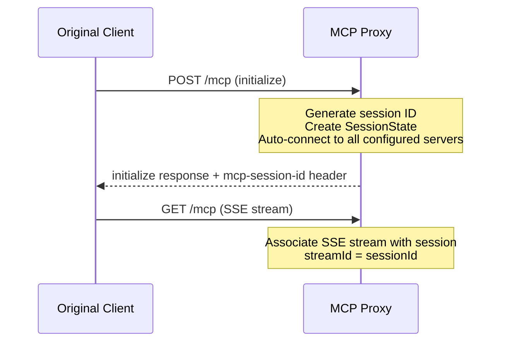
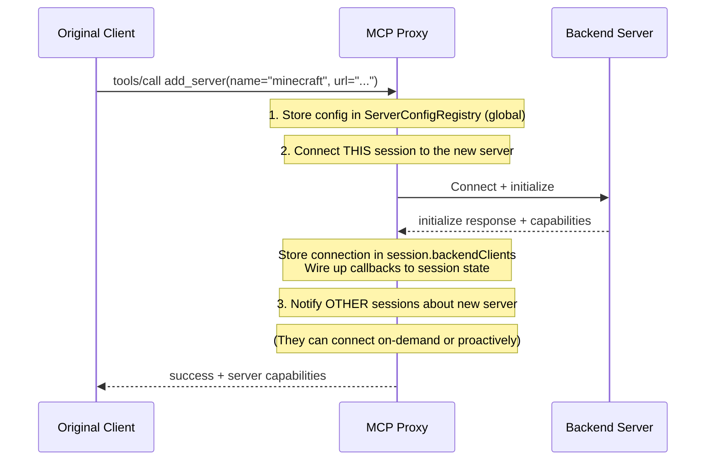
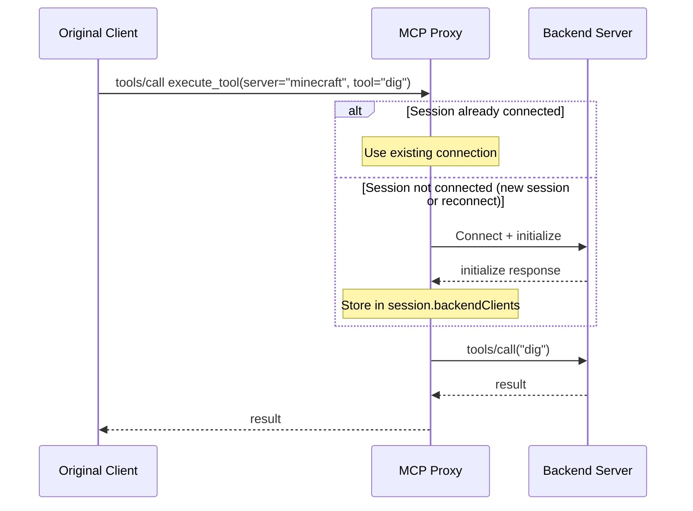
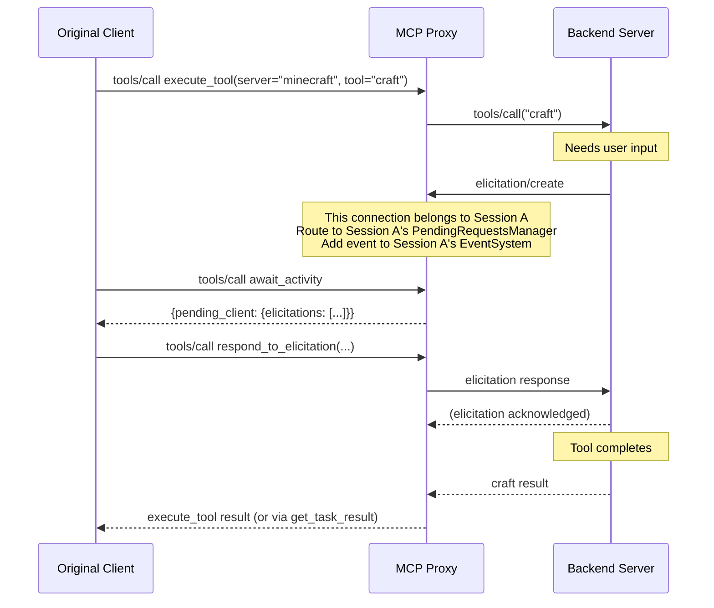
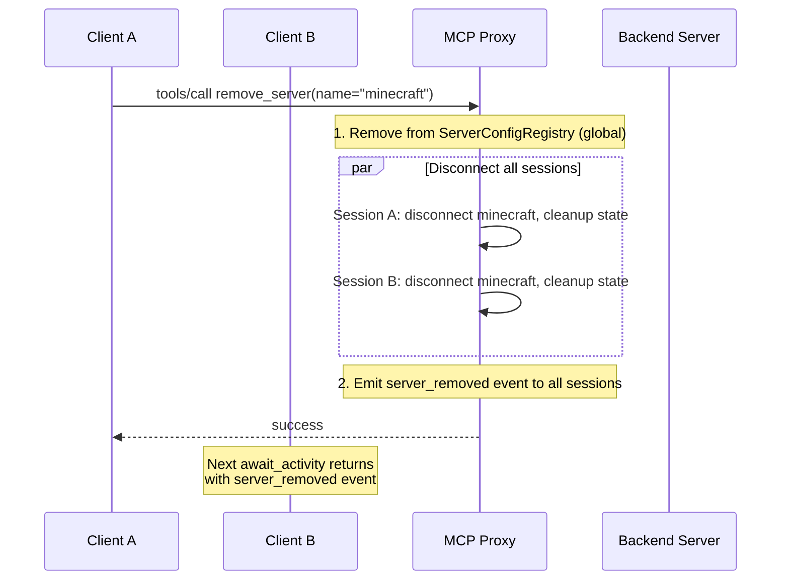
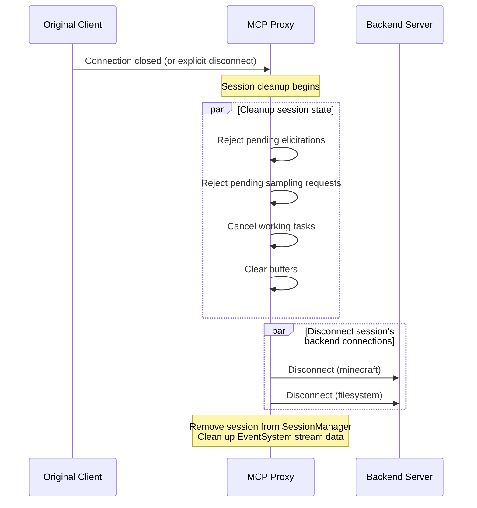
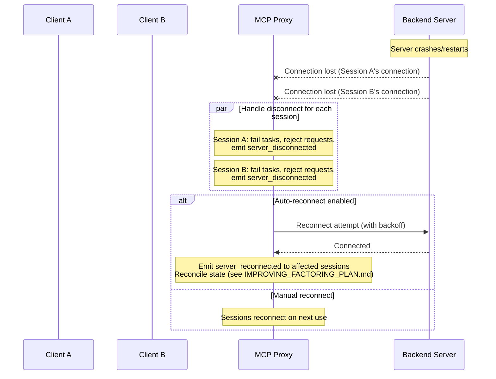
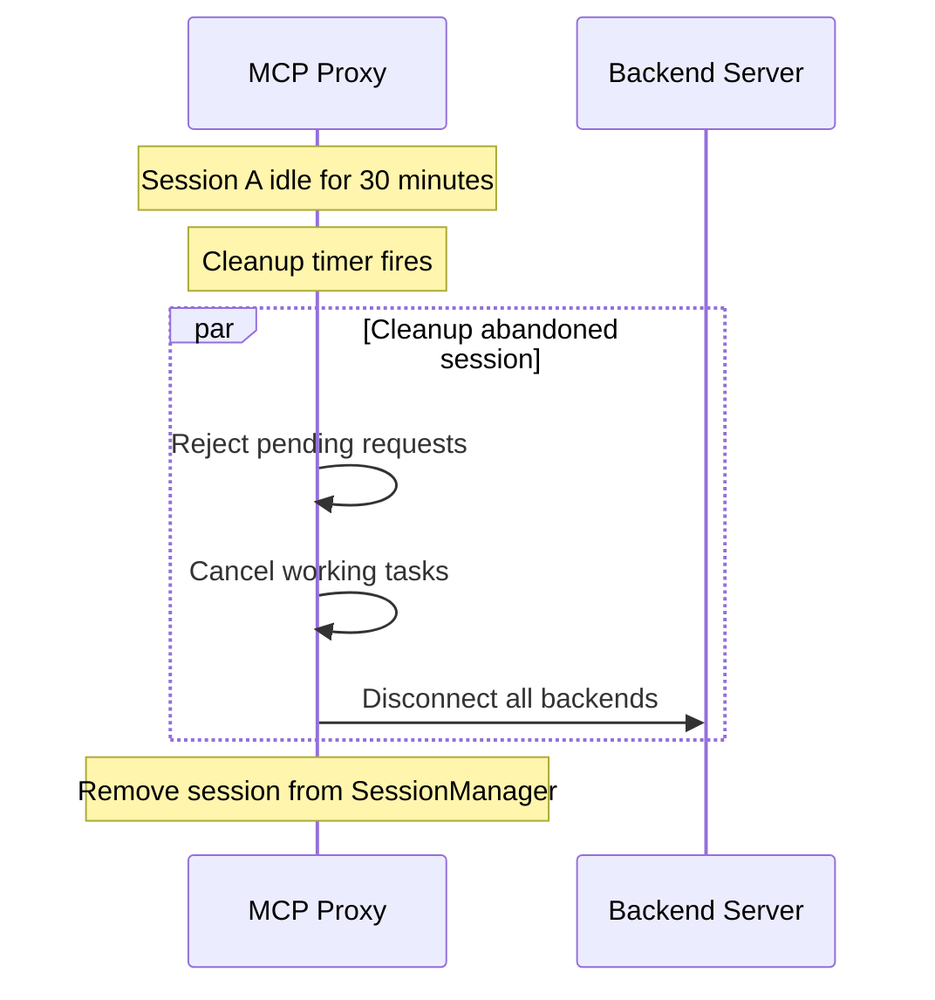

# Session State Management Design

This document defines how the MCP proxy manages state for client sessions, including event delivery, logging, pending state tracking, and backend server connections.

**Related Documents:**
- `IMPROVING_FACTORING_PLAN.md` - Implementation architecture and code structure
- `TASKS_AND_ELICITATIONS.md` - Task promotion, elicitation handling, tool execution model

## Core Principles

### 1. Per-Session Backend Connections

Each client session gets its own dedicated connections to backend MCP servers. This ensures:
- **Clean elicitation routing**: When a backend sends an elicitation, we know exactly which client session should receive it
- **Session isolation**: One session's state doesn't leak to another
- **Independent lifecycles**: Sessions can connect/disconnect independently

### 2. Shared Server Configuration

Server configurations (name → URL mappings) are shared globally:
- `add_server` adds a config that all sessions can use
- `remove_server` removes the config globally
- Adding a server automatically connects it for the calling session

### 3. Session-Scoped State

All runtime state is scoped to the client session (identified by `mcp-session-id`):
- Backend connections
- Tasks (promoted tool calls)
- Pending elicitations/sampling requests
- Event buffers
- Log buffers

When events affect multiple sessions (e.g., a globally-configured server's URL becomes unreachable), we create separate event records for each affected session.

## Architecture Overview

```
┌─────────────────────────────────────────────────────────────────────────────┐
│                              MCP Proxy                                       │
│                                                                              │
│  ┌────────────────────────────────────────────────────────────────────────┐ │
│  │                    Shared Infrastructure                                │ │
│  │  ┌─────────────────────┐                                               │ │
│  │  │  ServerConfigRegistry│  (EventSystem is per-session, not shared)    │ │
│  │  │  (name → URL mapping)│                                               │ │
│  │  └─────────────────────┘                                               │ │
│  └────────────────────────────────────────────────────────────────────────┘ │
│                                                                              │
│  ┌────────────────────────────────────────────────────────────────────────┐ │
│  │                         Session A                                       │ │
│  │  ┌─────────────┐  ┌─────────────┐  ┌─────────────┐                     │ │
│  │  │ minecraft   │  │ filesystem  │  │ database    │  Backend            │ │
│  │  │ connection  │  │ connection  │  │ connection  │  Connections        │ │
│  │  └──────┬──────┘  └──────┬──────┘  └──────┬──────┘                     │ │
│  │         │                │                │                             │ │
│  │  ┌──────┴────────────────┴────────────────┴──────┐                     │ │
│  │  │              Session State                     │                     │ │
│  │  │  - EventSystem (per-session)                   │                     │ │
│  │  │  - TaskManager (per-session)                   │                     │ │
│  │  │  - PendingRequestsManager (per-session)        │                     │ │
│  │  │  - BufferManager (per-session)                 │                     │ │
│  │  └────────────────────────────────────────────────┘                     │ │
│  └────────────────────────────────────────────────────────────────────────┘ │
│                                                                              │
│  ┌────────────────────────────────────────────────────────────────────────┐ │
│  │                         Session B                                       │ │
│  │  ┌─────────────┐  ┌─────────────┐                                      │ │
│  │  │ minecraft   │  │ filesystem  │  (no database connection yet)        │ │
│  │  │ connection  │  │ connection  │                                      │ │
│  │  └─────────────┘  └─────────────┘                                      │ │
│  │         ...session state...                                             │ │
│  └────────────────────────────────────────────────────────────────────────┘ │
└─────────────────────────────────────────────────────────────────────────────┘
```

## Session Lifecycle

### Phase 1: Client Connects to Proxy



**On session creation:**
1. Generate unique session ID (ULID)
2. Create SessionState with empty backend connections map
3. Create per-session EventSystem (owned by this session)
4. Create per-session state managers (TaskManager, PendingRequestsManager, BufferManager) - all use session's EventSystem
5. **Automatically connect to all configured servers** (from ServerConfigRegistry)
6. Return session ID to client

### Phase 2: Adding a Backend Server



**`add_server` behavior:**
1. **Store config globally** in ServerConfigRegistry
2. **Connect immediately** for the calling session
3. **Optionally notify** other sessions (they connect on first use or proactively)

### Phase 3: Using a Backend Server



**Lazy connection fallback:**
- If session doesn't have a connection but config exists, connect automatically
- This handles: new sessions, sessions created before server was added, reconnection after backend restart

### Phase 4: Elicitation Routing



**Key insight**: Because each session has its own connection to the backend, when an elicitation arrives on that connection, we know exactly which session it belongs to.

### Phase 5: Removing a Backend Server



**`remove_server` behavior:**
1. Remove config from ServerConfigRegistry
2. Disconnect ALL sessions from that server
3. Clean up per-session state (fail tasks, reject pending requests)
4. Emit `server_removed` event to all affected sessions

### Phase 6: Client Disconnects (Graceful)



### Phase 7: Backend Server Disconnects



### Phase 8: Session Timeout (Abandoned Session)



## Four Categories of State

### 1. Events (Exactly-Once Delivery via Tool Responses)

**What it includes:**
- MCP notifications from final servers
- Proxy-generated events:
  - `elicitation_request` - new elicitation arrived from backend
  - `sampling_request` - new sampling request arrived from backend
  - `task_created` - tool call promoted to task due to timeout
  - `task_completed` - background task finished successfully
  - `task_failed` - background task failed
  - `task_cancelled` - task was cancelled by client
  - `task_expired` - task exceeded its TTL
  - `server_connected` - backend server connection established
  - `server_disconnected` - backend server connection lost
  - `server_reconnected` - backend server reconnected after disconnect
  - `server_added` - new server config added (by any session)
  - `server_removed` - server config removed (by any session)

**Delivery semantics:**
- **Exactly-once** delivery per session (aim for this, err toward at-least-once)
- Events are returned in **two places**:
  1. The `await_activity` tool response (primary mechanism)
  2. As an additional field in **any** tool response if events occurred since last response
- After delivery via either mechanism, events are **marked as delivered** (tracked via `lastDeliveredId`)
- Uses ULID event IDs for ordering and deduplication

**Storage:**
- Events stored in **per-session EventSystem** (not shared)
- Events are **retained** for SSE replay (separate concern, see below)
- Delivery tracking via `lastDeliveredId` ensures exactly-once semantics
- When session ends, its EventSystem is discarded (clean cleanup)

**Example: Events in any tool response**

When a client calls any tool (e.g., `list_servers`), if events have occurred since the last tool response, they are included:

```json
{
  "content": [
    {
      "type": "text",
      "text": "{\"servers\": [\"minecraft\", \"filesystem\"]}"
    },
    {
      "type": "text",
      "text": "{\"events_since_last_response\": [{\"id\": \"01HQXYZ...\", \"type\": \"task_completed\", \"server\": \"minecraft\", \"data\": {\"taskId\": \"01HQABC...\"}}]}"
    }
  ]
}
```

### 2. Logs (On-Demand, Ring Buffer)

**What it includes:**
- MCP `logging/message` notifications from final servers
- Proxy operational logs (if exposed)

**Delivery semantics:**
- **Only delivered when explicitly requested** via `get_logs` tool
- Not included in regular tool responses
- Not part of `await_activity` by default

**Storage:**
- Fixed-size ring buffer per session (e.g., last 1000 log entries)
- Oldest entries rotated out when limit reached
- Traditional log-rotation approach

**Rationale:**
- Logs can be verbose and would overwhelm LLM context
- Client opts in when they need debugging info

**Example:**

```typescript
// Tool: get_logs
input: {
  server?: string,      // Filter to specific server
  level?: "debug" | "info" | "warn" | "error",  // Minimum level
  limit?: number,       // Max entries to return (default: 100)
}

output: {
  logs: [
    { timestamp: "...", server: "minecraft", level: "info", message: "..." },
    // ...
  ]
}
```

### 3. Pending-Waiting-On-Server (Include When Relevant)

**What it includes:**
- In-flight tasks (tool calls that timed out, still running on backend)

**Delivery semantics:**
- Included in `await_activity` response (always)
- Included in `execute_tool` timeout response (for that server only)
- Available via `get_server_status(server)` tool
- **Not** included in every tool response (unlike category 4)

**Lifecycle:**
- Created when tool call times out and promotes to task
- Removed when task completes, fails, expires, or is cancelled
- State persists until resolution

**Example: execute_tool timeout response**

When `execute_tool` times out, the response includes the created task AND all other pending-waiting-on-server state for that specific server:

```json
{
  "content": [
    {
      "type": "text",
      "text": "{\"timeout\": true, \"task\": {\"taskId\": \"01HQNEW...\", \"toolName\": \"dig\", \"status\": \"working\"}, \"server_pending\": {\"server\": \"minecraft\", \"working_tasks\": [{\"taskId\": \"01HQNEW...\", \"toolName\": \"dig\"}, {\"taskId\": \"01HQOLD...\", \"toolName\": \"build\"}]}, \"note\": \"Showing pending state for server 'minecraft' only. Use await_activity for all servers.\"}"
    }
  ]
}
```

### 4. Pending-Waiting-On-Client (Include in ALL Responses)

**What it includes:**
- Elicitation requests awaiting client response
- Sampling requests awaiting client response

**Delivery semantics:**
- Included in **every** tool response as part of content
- Acts as constant reminder to client to address pending requests
- Not in `_meta` - directly in response content

**Lifecycle:**
- Created when backend server sends `elicitation/create` or `sampling/createMessage`
- Removed when client responds or request times out

**Rationale:**
- These are blocking operations - the backend is waiting
- Client needs persistent visibility to act on them
- Avoids client "forgetting" about pending requests between tool calls

**Example: Any tool response with pending client actions**

```json
{
  "content": [
    {
      "type": "text",
      "text": "{\"result\": \"Tool completed successfully\"}"
    },
    {
      "type": "text",
      "text": "{\"pending_client_action\": {\"elicitations\": [{\"requestId\": \"01HQ...\", \"server\": \"minecraft\", \"message\": \"Please confirm you want to break this block\", \"schema\": {...}}], \"sampling_requests\": []}}"
    }
  ]
}
```

## Response Structure Summary

Every tool response follows this pattern:

```typescript
interface ToolResponse {
  content: [
    // 1. The actual tool result
    { type: "text", text: JSON.stringify(toolResult) },

    // 2. Events since last response (Category 1) - if any
    // Only included if there are new events
    { type: "text", text: JSON.stringify({ events_since_last_response: [...] }) }?,

    // 3. Pending client actions (Category 4) - always if any exist
    // Included in EVERY response if there are pending requests
    { type: "text", text: JSON.stringify({ pending_client_action: {...} }) }?,
  ]
}
```

For `execute_tool` timeout specifically:

```typescript
interface ExecuteToolTimeoutResponse {
  content: [
    // 1. Timeout result with created task
    {
      type: "text",
      text: JSON.stringify({
        timeout: true,
        task: { taskId, toolName, status: "working", ... },
        // Category 3: Pending-waiting-on-server for THIS server only
        server_pending: {
          server: "minecraft",
          working_tasks: [...],  // All working tasks for this server
        },
        note: "Showing pending state for server 'minecraft' only. Use await_activity for all servers."
      })
    },

    // 2. Events since last response (if any)
    { type: "text", text: JSON.stringify({ events_since_last_response: [...] }) }?,

    // 3. Pending client actions (if any)
    { type: "text", text: JSON.stringify({ pending_client_action: {...} }) }?,
  ]
}
```

For `await_activity`:

```typescript
interface AwaitActivityResponse {
  content: [
    {
      type: "text",
      text: JSON.stringify({
        // What triggered the return
        triggers: [{ type: "event" | "timeout" | "immediate", ... }],

        // Category 1: Events (delivered and cleared)
        events: [
          { server: "minecraft", events: [...] },
        ],

        // Category 3: All pending-waiting-on-server across all servers
        pending_server: [
          {
            server: "minecraft",
            working_tasks: [{ taskId, toolName, status }],
          },
        ],

        // Category 4: Pending-waiting-on-client (also here for completeness)
        pending_client: {
          elicitations: [...],
          sampling_requests: [...],
        },
      })
    }
  ]
}
```

## Event Delivery Tracking

### Per-Session EventSystem

Each session has its own `EventSystem` instance. This is the natural design because:
- Each session has its own backend connections (elicitations route to the owning session)
- Each session has its own SSE stream (replay only needs that session's events)
- Session cleanup is simple (discard the whole EventSystem)
- No `streamId` tagging needed - all events belong to the session

```typescript
// Per-session EventSystem (see IMPROVING_FACTORING_PLAN.md for full implementation)
class EventSystem {
  private readonly events: StoredEvent[] = [];
  private lastDeliveredId: string | null = null;

  // Add event to this session's event store
  addEvent(type: ProxyEventType, server: string, data: unknown): string {
    const id = ulid();
    this.events.push({ id, type, server, data, createdAt: new Date() });
    // Also emits to wake await_activity waiters
    return id;
  }

  // Get new events (events after lastDeliveredId)
  // Marks returned events as "delivered" by updating lastDeliveredId
  getNewEvents(): StoredEvent[] {
    // ... filter events after lastDeliveredId, update lastDeliveredId
  }

  // For SSE replay - get events after a given ID (no delivery tracking)
  getEventsAfter(lastEventId: string | null): StoredEvent[] { /* ... */ }

  // Check if there are undelivered events (without marking as delivered)
  hasNewEvents(): boolean { /* ... */ }
}
```

**Key points:**
- Events are **retained** after delivery (for SSE replay)
- `lastDeliveredId` tracks what has been delivered via tool responses
- `getNewEvents()` both retrieves AND marks events as delivered (atomic operation)
- No `streamId` needed - the EventSystem belongs to exactly one session

### Broadcast Events

When an event affects all sessions (e.g., `server_removed` from ServerConfigRegistry), iterate over sessions and add to each session's EventSystem:

```typescript
class SessionManager {
  private sessions = new Map<string, SessionState>();

  broadcastEvent(type: ProxyEventType, server: string, data: unknown): void {
    for (const [sessionId, session] of this.sessions) {
      // Each session's EventSystem gets its own event
      session.eventSystem.addEvent(type, server, data);
    }
  }
}
```

## SSE Replay (Separate Concern)

SSE replay is a **transport-layer** concern, separate from the application-level event delivery semantics above.

### Two Levels of Event Delivery

| Level | Semantics | Mechanism | Purpose |
|-------|-----------|-----------|---------|
| **Application** | Exactly-once | `getNewEventsForStream()` with `lastDeliveredId` tracking | Tool responses to LLM client |
| **Transport** | At-least-once | `getEventsAfter(lastEventId)` for SSE reconnection | HTTP SSE stream resume |

### Why At-Least-Once for SSE?

When an SSE connection drops and reconnects (using `Last-Event-ID` header):
- The client may have received an event but crashed before processing it
- We can't know what the client actually processed
- Therefore we replay from the last acknowledged ID (at-least-once)
- The ULID event IDs enable client-side deduplication if needed

### Implementation

Each session's `EventSystem` handles both concerns:

```typescript
class EventSystem {
  // For application-level exactly-once (tool responses)
  getNewEvents(): StoredEvent[] { /* updates lastDeliveredId */ }

  // For transport-level at-least-once (SSE replay)
  getEventsAfter(lastEventId: string | null): StoredEvent[] { /* no tracking */ }
}
```

The transport layer uses `getEventsAfter()` which:
- Returns events after the given `lastEventId` (from SSE `Last-Event-ID` header)
- Does NOT update any delivery tracking (transport doesn't know about application state)
- Falls back to returning all events if `lastEventId` is not found (client too far behind)

## Implementation Notes

### Session Identification

Sessions are identified by `mcp-session-id` header. Each session gets:
- Its own **backend connections** (one per configured server)
- Its own **event store** (Category 1)
- Its own **log buffer** (Category 2)
- Its own **pending-waiting-on-server state** (Category 3) - tasks for this session's tool calls
- Its own **pending-waiting-on-client state** (Category 4) - elicitations/sampling from this session's backend connections

### What's Shared vs Per-Session

| Component | Scope | Rationale |
|-----------|-------|-----------|
| Server configs (name → URL) | **Shared** | All sessions can use same backends |
| Backend MCP connections | **Per-Session** | Elicitations route to correct session |
| TaskManager | **Per-Session** | Tasks belong to session that created them |
| PendingRequestsManager | **Per-Session** | Elicitations belong to session's connection |
| BufferManager | **Per-Session** | Notifications scoped to session |
| EventSystem | **Per-Session** | Events belong to session, no streamId tagging needed |

### Event ID Format

All events use ULIDs:
- Time-sortable (lexicographic ordering = chronological ordering)
- Globally unique (no coordination needed)
- URL-safe (no special characters)

Example: `01HQX7YJZK5J9ZK3XQGM8R4T5V`

### Cleanup

- **Session end**: Clear all session-specific state (events, logs)
- **Server disconnect**: Broadcast `server_disconnected` event to all sessions
- **Request timeout**: Clear from pending maps, emit expiration event

## Examples

### Example 1: Normal Tool Call

Client calls `list_servers`, no pending events or actions:

```json
{
  "content": [
    { "type": "text", "text": "{\"servers\": [\"minecraft\"]}" }
  ]
}
```

### Example 2: Tool Call with Pending Elicitation

Client calls `list_servers`, there's a pending elicitation:

```json
{
  "content": [
    { "type": "text", "text": "{\"servers\": [\"minecraft\"]}" },
    { "type": "text", "text": "{\"pending_client_action\": {\"elicitations\": [{\"requestId\": \"01HQ...\", \"server\": \"minecraft\", \"message\": \"Confirm action?\"}], \"sampling_requests\": []}}" }
  ]
}
```

### Example 3: Tool Call with Events Since Last Response

Client calls `list_servers`, a task completed since their last tool call:

```json
{
  "content": [
    { "type": "text", "text": "{\"servers\": [\"minecraft\"]}" },
    { "type": "text", "text": "{\"events_since_last_response\": [{\"id\": \"01HQ...\", \"type\": \"task_completed\", \"server\": \"minecraft\", \"data\": {\"taskId\": \"01HQABC...\"}}]}" }
  ]
}
```

### Example 4: execute_tool Timeout

Tool call times out, there's also another working task and a pending elicitation:

```json
{
  "content": [
    {
      "type": "text",
      "text": "{\"timeout\": true, \"task\": {\"taskId\": \"01HQNEW...\", \"toolName\": \"dig\", \"status\": \"working\"}, \"server_pending\": {\"server\": \"minecraft\", \"working_tasks\": [{\"taskId\": \"01HQNEW...\", \"toolName\": \"dig\"}, {\"taskId\": \"01HQOLD...\", \"toolName\": \"build\"}]}, \"note\": \"Showing pending state for server 'minecraft' only.\"}"
    },
    { "type": "text", "text": "{\"pending_client_action\": {\"elicitations\": [{\"requestId\": \"01HQ...\", \"server\": \"minecraft\", \"message\": \"Confirm?\"}], \"sampling_requests\": []}}" }
  ]
}
```

### Example 5: await_activity Response

Client calls `await_activity`, gets full state:

```json
{
  "content": [
    {
      "type": "text",
      "text": "{\"triggers\": [{\"type\": \"event\", \"eventType\": \"task_completed\"}], \"events\": [{\"server\": \"minecraft\", \"events\": [{\"id\": \"01HQ...\", \"type\": \"task_completed\", \"data\": {\"taskId\": \"01HQABC...\"}}]}], \"pending_server\": [{\"server\": \"minecraft\", \"working_tasks\": [{\"taskId\": \"01HQDEF...\", \"toolName\": \"build\"}]}], \"pending_client\": {\"elicitations\": [], \"sampling_requests\": []}}"
    }
  ]
}
```
