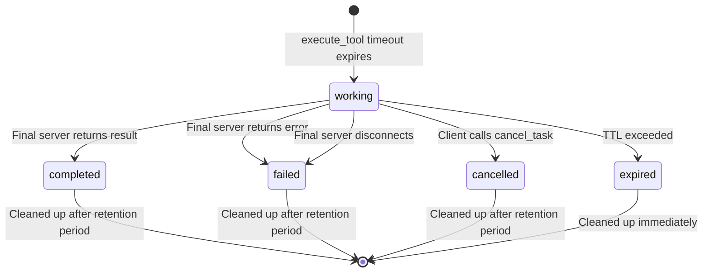
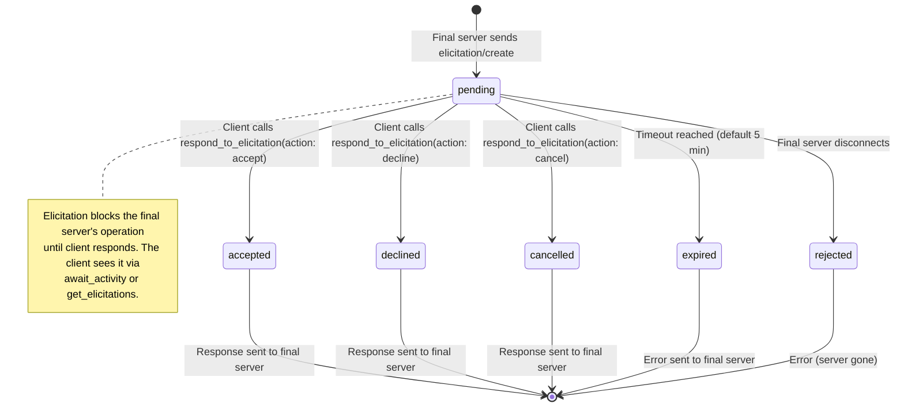
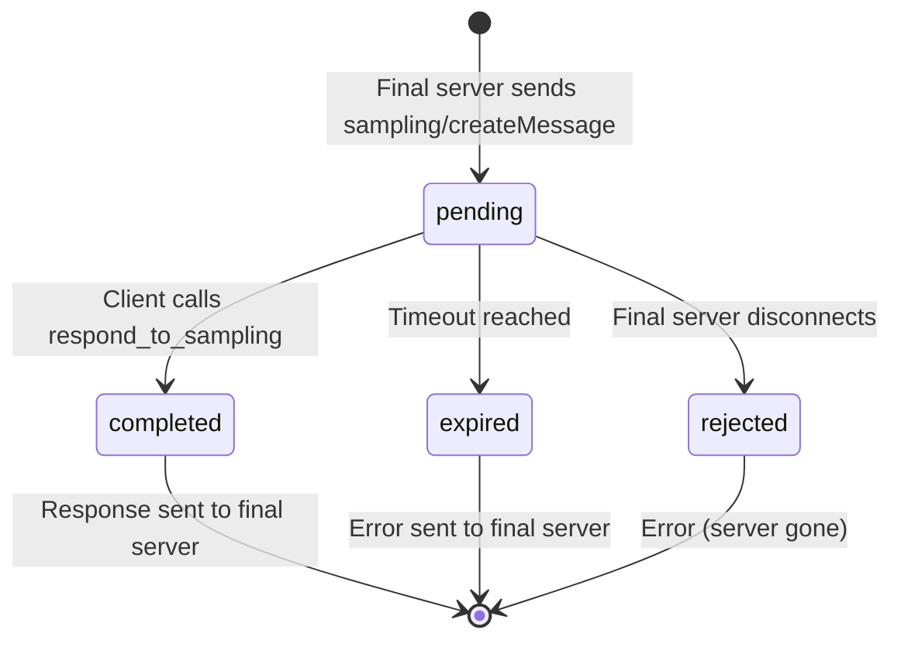
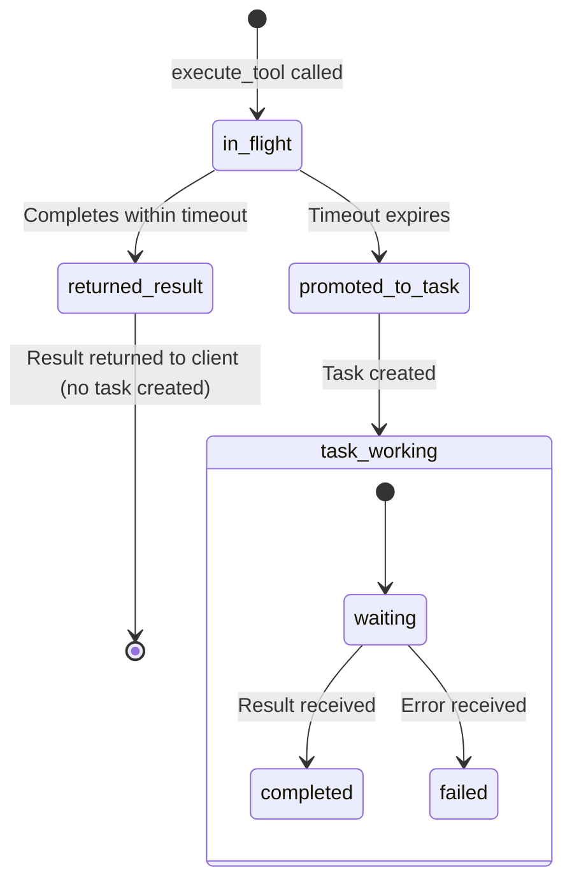
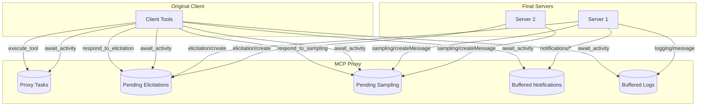
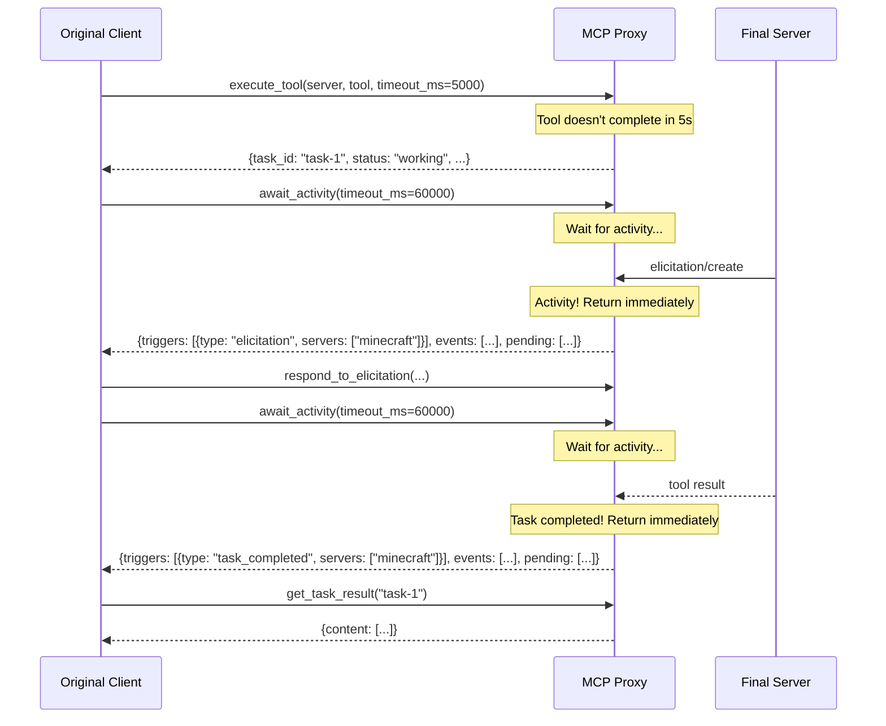
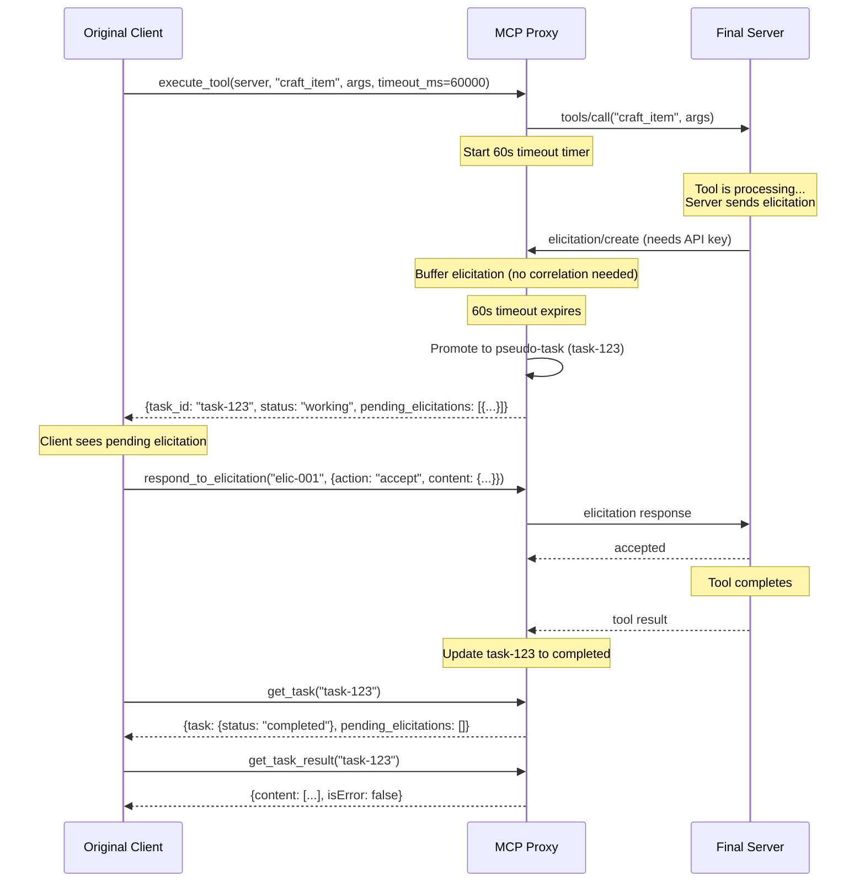
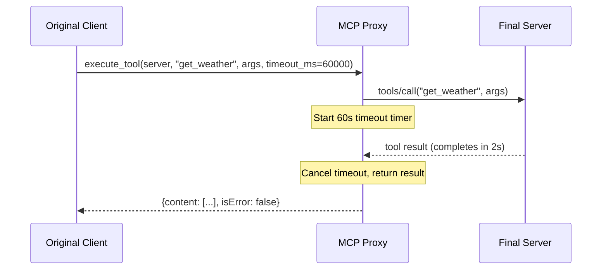
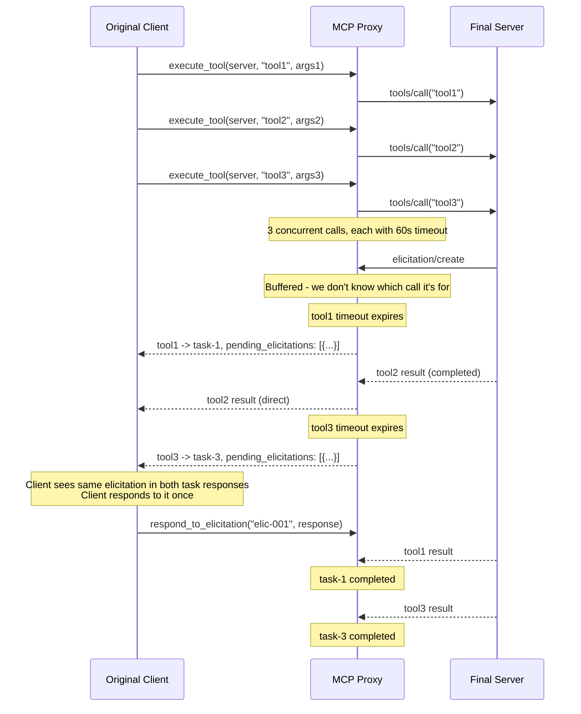

# Tasks and Elicitations: Handling Blocking Tool Calls in MCP Proxy

## Summary

This document describes how the MCP Proxy handles tool calls that may block waiting for elicitations (user input requests from final servers).

**Key Design Decisions:**

1. **Timeout-based task promotion**: Tool calls wait up to a configurable timeout (default 60s). If they complete, return the result directly. If timeout expires, promote to a "pseudo-task" and return task info.

2. **Decoupled elicitations**: We don't try to correlate elicitations to specific tool calls (this is unreliable without MCP Tasks support). Instead, we surface all pending elicitations alongside task info.

3. **`await_activity` for efficient polling**: A single tool that waits for any async activity (elicitations, notifications, task completions, etc.) and returns immediately when something happens.

**New Tools:**

| Tool | Purpose |
|------|---------|
| `list_tasks` | List all pseudo-tasks |
| `get_task` | Get task details + pending elicitations for that server |
| `get_task_result` | Block until task completes, return result |
| `cancel_task` | Cancel a pending task |
| `await_activity` | Wait for any async activity, return current state |

**Modified Tools:**

| Tool | Change |
|------|--------|
| `execute_tool` | New `timeout_ms` parameter (default 60s). Returns task info if timeout expires. |

**New Resources:**

| URI | Purpose |
|-----|---------|
| `emceepee://diagrams` | Returns mermaid diagrams for all entity state machines (tasks, elicitations, sampling requests, tool call lifecycle) |

---

## Problem Statement

The MCP Proxy sits between an **original client** (e.g., Claude Code) and one or more **final servers** (backend MCP servers). When the original client calls `execute_tool`, we forward that to the appropriate final server. However, some tool calls on final servers may **block** waiting for an elicitation to be completed.

### The Challenge

When a final server needs user input during a tool call:

1. The final server sends an `elicitation/create` request back to us (we're its client)
2. This elicitation arrives either:
   - As an SSE message on the tool call POST response stream
   - As a request on the session GET SSE connection
3. We have an **open tool call** from our original client that cannot complete until:
   - We get the elicitation
   - Forward it somehow to the original client
   - The original client provides input
   - We send that input back to the final server
   - The final server completes the original tool call

The MCP protocol doesn't provide a native way to "pause" a tool call and request additional input mid-flight. We need a mechanism to handle this.

## Proposed Solution: Pseudo-Tasks for Blocked Tool Calls

### Overview

We will model blocked tool calls as **pseudo-tasks** - local task objects managed by the proxy that represent in-flight operations. When a tool call becomes blocked on an elicitation:

1. Create a pseudo-task to represent the blocked tool call
2. Return immediately to the original client with task info + the elicitation request
3. The original client handles the elicitation (e.g., prompts user, gets input)
4. The original client responds to the elicitation via our tools
5. We forward the elicitation response to the final server
6. The final server completes the tool call
7. The original client retrieves the result via `get_task_result`

### Key Design Decisions

#### 1. Entity Models and State Diagrams

The proxy manages several entity types, each with its own lifecycle. Understanding these is critical.

##### 1.1 Proxy Tasks (Tool Calls Promoted After Timeout)

Tasks represent tool calls that exceeded their timeout and are now tracked asynchronously.

```typescript
interface ProxyTask {
  taskId: string;              // UUID generated by proxy
  createdAt: Date;
  lastUpdatedAt: Date;
  server: string;              // Final server name
  toolName: string;            // Tool being called
  toolArgs: Record<string, unknown>;
  status: ProxyTaskStatus;
  statusMessage?: string;
  result?: CallToolResult;     // Set when completed
  error?: string;              // Set when failed
  ttl: number;                 // ms from creation before cleanup
}

type ProxyTaskStatus =
  | "working"           // Tool call in progress on final server
  | "completed"         // Success - result available via get_task_result
  | "failed"            // Error - check error field
  | "cancelled"         // Client cancelled via cancel_task
  | "expired";          // TTL exceeded, result discarded
```

**State Diagram:**



**Key Points:**
- Tasks are created ONLY when `execute_tool` timeout expires
- Fast tool calls never create tasks
- The tool call continues running on the final server even after promotion to task
- Terminal states: `completed`, `failed`, `cancelled`, `expired`

##### 1.2 Pending Elicitations (Server Requests for User Input)

Elicitations are requests FROM the final server TO our proxy, asking for user input. They remain pending until the original client responds.

```typescript
interface PendingElicitation {
  requestId: string;           // Our internal ID for tracking
  server: string;              // Which final server sent this
  timestamp: Date;             // When received
  params: ElicitRequestParams; // The elicitation details (mode, message, schema, etc.)

  // Internal: Promise handlers to resolve the server's request
  resolve: (result: ElicitResult) => void;
  reject: (error: Error) => void;
}

type ElicitationOutcome = "accepted" | "declined" | "cancelled" | "expired";
```

**State Diagram:**



**Key Points:**
- Elicitations arrive FROM the final server (we are its client)
- They remain `pending` until the original client responds via `respond_to_elicitation`
- The final server is BLOCKED waiting for our response
- We don't correlate elicitations to specific tasks (see "Correlating Elicitations" section)
- Elicitations have their own timeout (separate from task TTL)

##### 1.3 Pending Sampling Requests (Server Requests for LLM Completion)

Sampling requests are similar to elicitations - the final server asks us to generate an LLM response.

```typescript
interface PendingSamplingRequest {
  requestId: string;
  server: string;
  timestamp: Date;
  params: CreateMessageRequestParams;
  resolve: (result: CreateMessageResult) => void;
  reject: (error: Error) => void;
}
```

**State Diagram:**



##### 1.4 Tool Call Lifecycle (Before Task Promotion)

Tool calls start synchronously and may or may not be promoted to tasks.



##### 1.5 Overall Entity Relationships



#### 2. Modified `execute_tool` Behavior

The `execute_tool` schema adds an optional timeout parameter:

```typescript
{
  server: z.string(),
  tool: z.string(),
  args: z.record(z.unknown()).optional(),
  timeout_ms: z.number().optional().default(60000),  // Default 60 seconds
}
```

**Behavior:**

1. **Start the tool call** on the final server
2. **Wait up to `timeout_ms`** for the tool to complete
3. **If tool completes within timeout**: Return result directly (fully backwards compatible)
4. **If timeout expires before completion**:
   - Create a pseudo-task to track the in-flight tool call
   - Return immediately with:
     - Task ID and status (`working`)
     - Any pending elicitations for this server (regardless of correlation)
   - Original client can then:
     - Respond to any pending elicitations via `respond_to_elicitation`
     - Poll task status via `get_task` or retrieve result via `get_task_result`

**Why timeout-based rather than elicitation-triggered?**

- We can't reliably detect "this tool call is blocked on an elicitation" without MCP Tasks
- An elicitation might arrive but not be for *this* tool call
- A timeout is a clear, predictable signal that something is taking longer than expected
- The original client can set a short timeout (e.g., 5s) if it wants to handle all long-running calls as tasks

#### 3. New Tools for Task Management

```typescript
// List all proxy tasks
tool: "list_tasks"
input: {
  server?: string,           // Filter by server name
  status?: ProxyTaskStatus,  // Filter by status
  include_completed?: boolean, // Include completed/failed (default: false)
}
returns: ProxyTask[]

// Get specific task details (includes pending elicitations for the server)
tool: "get_task"
input: {
  task_id: string,
}
returns: {
  task: ProxyTask,
  pending_elicitations: ElicitationInfo[],  // All pending elicitations for this server
}

// Get task result (blocks if not complete, respects TTL)
tool: "get_task_result"
input: {
  task_id: string,
  timeout_ms?: number,  // Max wait time (default: remaining TTL)
}
returns: CallToolResult | { error: string }

// Cancel a task
tool: "cancel_task"
input: {
  task_id: string,
}
returns: { success: boolean, message: string }
```

#### 4. The `await_activity` Tool

This is a key tool for efficient polling. It allows the original client to wait for any async activity across all servers, rather than polling individual endpoints.

```typescript
tool: "await_activity"
input: {
  timeout_ms: z.number().default(30000),  // Max wait time (default 30s)
}
returns: {
  // What triggered the return - array since multiple events can occur simultaneously
  triggers: (
    | { type: "timeout" }
    | { type: "elicitation"; servers: string[] }
    | { type: "sampling"; servers: string[] }
    | { type: "notification"; servers: string[] }
    | { type: "log"; servers: string[] }
    | { type: "task_completed"; servers: string[] }
    | { type: "task_failed"; servers: string[] }
    | { type: "task_cancelled"; servers: string[] }
  )[],

  // New events since last call - organized by server (cleared on read)
  events: {
    server: string,
    tasks_completed: ProxyTask[],          // Tasks that just completed
    tasks_failed: ProxyTask[],             // Tasks that just failed
    tasks_cancelled: ProxyTask[],          // Tasks that just got cancelled
    elicitations: ElicitationInfo[],       // New elicitation requests
    sampling_requests: SamplingRequestInfo[], // New sampling requests
    notifications: NotificationInfo[],     // New notifications
    logs: LogInfo[],                       // New log messages
  }[],

  // Current outstanding items awaiting action - organized by server
  pending: {
    server: string,
    tasks: ProxyTask[],                    // Tasks still in "working" state
    elicitations: ElicitationInfo[],       // Elicitations awaiting response
    sampling_requests: SamplingRequestInfo[], // Sampling requests awaiting response
  }[],
}
```

**Key Distinctions:**

| Field | Purpose | Cleared on read? |
|-------|---------|------------------|
| `triggers` | Why this call returned (timeout or specific event types) | N/A (computed) |
| `events` | New things that arrived since last `await_activity` call | Yes |
| `pending` | Outstanding items that need client action | No (always current state) |

**Behavior:**

1. **Check for immediate events** - If any of the following have occurred since last call, return immediately:
   - New notifications arrived
   - New log messages arrived
   - New elicitation requests arrived
   - New sampling requests arrived
   - Task state changes (completed, failed, cancelled)

2. **If no events, wait up to `timeout_ms`** for any of:
   - A notification arrives from any server
   - An elicitation request arrives from any server
   - A sampling request arrives from any server
   - A task transitions to a terminal state (completed/failed/cancelled)

3. **On activity or timeout, return:**
   - `triggers`: What caused the return (array - multiple events can trigger simultaneously)
   - `events`: New items since last call, organized by server (cleared after return)
   - `pending`: Current outstanding items, organized by server (always reflects current state)

**Use Cases:**

- **Efficient polling**: Instead of calling `get_task`, `get_elicitations`, `get_sampling_requests`, `get_notifications` separately, call `await_activity` once
- **Event-driven flow**: Client can wait for something to happen rather than polling repeatedly
- **Reduced latency**: Returns immediately when activity occurs, no need to wait for poll interval
- **Multi-server awareness**: Client sees activity from all servers in one response, organized by server

**Example Flow:**



#### 5. Elicitation Tools (Unchanged)

The existing `get_elicitations` and `respond_to_elicitation` tools work exactly as before:

- `get_elicitations` returns all pending elicitation requests from all servers
- `respond_to_elicitation` sends a response to a pending elicitation

**No task correlation is attempted.** Elicitations are independent of tasks. The original client:
1. Sees pending elicitations via `get_elicitations` or in task responses
2. Responds to them via `respond_to_elicitation`
3. This unblocks whatever server-side operation was waiting
4. Tasks complete when their underlying tool calls complete

### Implementation Architecture

```
┌─────────────────────────────────────────────────────────────────┐
│                      Original Client                              │
│                   (e.g., Claude Code)                            │
└─────────────────────────────────────────────────────────────────┘
                              │
                    execute_tool (with timeout_ms)
                              │
                              ▼
┌─────────────────────────────────────────────────────────────────┐
│                        MCP Proxy                                 │
│  ┌───────────────────────────────────────────────────────────┐  │
│  │                  ToolCallManager                           │  │
│  │  - Tracks in-flight tool calls with timeouts              │  │
│  │  - Promotes timed-out calls to pseudo-tasks               │  │
│  │  - Manages pseudo-task lifecycle                           │  │
│  └───────────────────────────────────────────────────────────┘  │
│  ┌───────────────────────────────────────────────────────────┐  │
│  │                  ServerRegistry                            │  │
│  │  - MCPHttpClient per backend                              │  │
│  │  - Routes tool calls                                       │  │
│  │  - Buffers elicitations (no correlation)                   │  │
│  └───────────────────────────────────────────────────────────┘  │
└─────────────────────────────────────────────────────────────────┘
                              │
                         callTool()
                              │
                              ▼
┌─────────────────────────────────────────────────────────────────┐
│                      Final Server                                │
│               (e.g., Minecraft MCP server)                       │
└─────────────────────────────────────────────────────────────────┘
```

### Correlating Elicitations to Tool Calls

This is a critical challenge. When we have multiple concurrent tool calls to the same final server, and we receive an elicitation request, **how do we know which tool call triggered it?**

#### The Correlation Problem

```
Proxy -> callTool("dig")   -----> Final Server
Proxy -> callTool("craft") -----> Final Server
Proxy -> callTool("build") -----> Final Server
                                       |
Proxy <-- elicitation/create <---------+  (which tool?)
```

#### What the MCP Specs Provide

**Tools spec (without tasks):** No correlation mechanism exists. The only ID is the JSON-RPC `id` which correlates the request to its direct response - but elicitations are *separate* requests from the server to the client, not responses. There's no `related-tool` metadata or similar.

**Tasks spec:** Provides correlation via `_meta["io.modelcontextprotocol/related-task"]`. When using task-augmented requests, all related messages (including elicitations) MUST include the `taskId` in `_meta`. This allows matching elicitations to their originating tool calls.

**However**, task-based correlation only works if:
1. The final server declares `tasks.requests.tools.call` capability
2. We send task-augmented requests to the final server
3. The final server properly includes `related-task` metadata in elicitations

#### Our Strategy: Timeout-Based Task Promotion with Decoupled Elicitations

Rather than trying to correlate elicitations to specific tool calls (which is unreliable without MCP Tasks), we use a simpler approach:

1. **Wait for tool completion with timeout** - All tool calls wait up to a configurable timeout (default 60s)
2. **If completed within timeout** - Return result directly (fully backwards compatible)
3. **If timeout expires** - Promote to pseudo-task, return task info + any pending elicitations
4. **Decouple elicitation correlation** - Don't try to link elicitations to specific tool calls; just expose all pending elicitations for the server

**Key Insight:** We don't need to know *which* tool call an elicitation is for. We just need to:
- Tell the original client "your tool call is taking a while, here's a task ID"
- Tell the original client "by the way, this server has pending elicitations"
- Let the original client respond to elicitations and poll for task completion

This approach:
- **Preserves parallelism** - Multiple concurrent tool calls are allowed
- **Avoids correlation complexity** - We don't pretend to know which elicitation goes with which call
- **Lets the original client decide** - It can respond to elicitations and check which tasks complete
- **Works with any server** - No dependency on MCP Tasks support

**Optional Enhancement: Use MCP Tasks When Available**

If the final server supports `tasks.requests.tools.call`, we CAN use task-augmented requests to get proper correlation via `related-task` metadata. This is an optimization, not a requirement:

```typescript
if (serverCapabilities?.tasks?.requests?.tools?.call) {
  // Optimization: use task-augmented requests for better correlation
  // Elicitations will include io.modelcontextprotocol/related-task
}
```

But even without this, the timeout-based approach works correctly.

#### Implementation Details

```typescript
interface PendingToolCall {
  proxyTaskId: string;         // Our pseudo-task ID (assigned on timeout)
  server: string;              // Server name
  toolName: string;
  args: Record<string, unknown>;
  startedAt: Date;
  resolve: (result: CallToolResult) => void;
  reject: (error: Error) => void;
  promotedToTask: boolean;     // True once timeout triggered
}

// In ServerRegistry or TaskManager
class ToolCallManager {
  // All in-flight tool calls, keyed by internal ID
  private pendingCalls: Map<string, PendingToolCall>;

  // Pseudo-tasks (promoted from timed-out tool calls)
  private tasks: Map<string, ProxyTask>;

  async executeToolWithTimeout(
    server: string,
    tool: string,
    args: Record<string, unknown>,
    timeoutMs: number
  ): Promise<ExecuteToolResponse> {
    const callId = crypto.randomUUID();
    const call: PendingToolCall = { ... };
    this.pendingCalls.set(callId, call);

    // Race: tool completion vs timeout
    const result = await Promise.race([
      this.executeOnServer(server, tool, args),
      this.waitForTimeout(timeoutMs),
    ]);

    if (result.type === 'completed') {
      this.pendingCalls.delete(callId);
      return { type: 'result', result: result.value };
    }

    // Timeout - promote to task
    const task = this.promoteToTask(call);
    const pendingElicitations = this.getPendingElicitationsForServer(server);

    return {
      type: 'task_created',
      taskId: task.taskId,
      status: 'working',
      pendingElicitations,
    };
  }
}
```

#### Flow: Timeout-Based Task Promotion

This is the primary flow that works with any server (with or without MCP Tasks support):



**Key Points:**

1. **No correlation required** - We don't try to link the elicitation to the specific tool call
2. **Timeout triggers task creation** - The tool call becomes a task only when it exceeds the timeout
3. **Elicitations are surfaced alongside task info** - The client sees all pending elicitations for the server
4. **Client drives resolution** - The client responds to elicitations and polls for task completion

#### Flow: Fast Tool Call (No Task Created)

If the tool completes within the timeout, no task is created:



This is fully backwards compatible with the current behavior.

#### Flow: Multiple Concurrent Tool Calls

Multiple tool calls can run in parallel. Each has its own timeout:



**Important:** The same pending elicitation may be reported in multiple task responses until it's resolved. This is by design - we don't know which task it belongs to, so we surface it everywhere relevant.

#### Optional: Enhanced Flow with MCP Tasks

If the final server supports `tasks.requests.tools.call`, we can optionally use task-augmented requests for better correlation. This is an optimization:

- Send `tools/call` with `task: { ttl }` parameter
- Server returns `CreateTaskResult` with `taskId`
- Elicitations include `_meta["io.modelcontextprotocol/related-task"]`
- We can correlate elicitations to specific tool calls

However, the timeout-based approach remains the fallback and works even if the server's task implementation is incomplete.

### Edge Cases and Error Handling

#### 1. Tool Call Timeout Behavior

When `execute_tool` timeout expires:
- Create pseudo-task to track the still-in-flight tool call
- Return task info + any pending elicitations for that server
- Task status is `working` (not a special "pending elicitation" state)
- The tool call continues executing in the background

The original client should:
- Check `pending.elicitations` in the response or call `await_activity`
- Respond to any elicitations that might be blocking the tool
- Poll `get_task` or use `await_activity` to detect completion

#### 2. Final Server Disconnects

- All tasks for that server move to `failed` status
- Pending elicitation resolvers are rejected
- Tool call promises are rejected
- `await_activity` returns immediately with the failure event

#### 3. Multiple Elicitations for Single Tool Call

Some operations might require multiple rounds of elicitation:
- Task remains in `working` status throughout
- Each new elicitation is buffered and surfaced via `await_activity` or `get_elicitations`
- Original client responds to each in turn
- Only when the underlying tool call completes does task move to `completed`

#### 4. TTL Expiration

- Tasks that exceed TTL are marked `expired`
- Associated Promises are rejected
- `get_task_result` for expired tasks returns error
- Expired tasks are cleaned up after a grace period

#### 5. Client Reconnection

Since we use HTTP transport:
- Task state persists across HTTP requests (stateful proxy)
- Original client can resume by calling `list_tasks`, `get_task`, or `await_activity`
- Session ID ties tasks to specific client sessions

#### 6. Concurrent `await_activity` Calls

If the original client makes multiple concurrent `await_activity` calls:
- All waiters are woken when activity occurs
- Each receives the same trigger event
- Buffers (notifications, logs) are cleared after the first response
- Subsequent responses in the same "batch" will have empty buffers but same `pending` state

### Configuration Options

```typescript
interface TaskConfig {
  // Default TTL for new tasks (default: 5 minutes)
  defaultTtlMs: number;

  // Maximum TTL allowed (default: 30 minutes)
  maxTtlMs: number;

  // How often to run cleanup (default: 1 minute)
  cleanupIntervalMs: number;

  // How long to keep completed tasks (default: 5 minutes)
  completedRetentionMs: number;

  // Maximum concurrent tasks per session (default: 100)
  maxTasksPerSession: number;
}
```

### Response Formats

#### `execute_tool` - Tool Completed Within Timeout

Normal tool result (unchanged from current behavior):

```json
{
  "content": [
    { "type": "text", "text": "Tool completed successfully" }
  ],
  "isError": false
}
```

#### `execute_tool` - Timeout Triggered, Task Created

When the tool call exceeds `timeout_ms`:

```json
{
  "content": [
    {
      "type": "text",
      "text": "Tool call exceeded timeout. Promoted to task."
    }
  ],
  "_meta": {
    "proxy_task": {
      "task_id": "550e8400-e29b-41d4-a716-446655440000",
      "status": "working",
      "created_at": "2025-12-30T10:30:00Z",
      "server": "minecraft",
      "tool": "some_tool"
    },
    "pending_elicitations": [
      {
        "request_id": "abc123",
        "server": "minecraft",
        "mode": "form",
        "message": "Please provide your API key",
        "requested_schema": { ... }
      }
    ]
  }
}
```

#### `get_task` Response

```json
{
  "task": {
    "task_id": "550e8400-e29b-41d4-a716-446655440000",
    "status": "working",
    "created_at": "2025-12-30T10:30:00Z",
    "last_updated_at": "2025-12-30T10:31:00Z",
    "server": "minecraft",
    "tool": "some_tool"
  },
  "pending_elicitations": [
    {
      "request_id": "abc123",
      "server": "minecraft",
      "mode": "form",
      "message": "Please provide your API key",
      "requested_schema": { ... }
    }
  ]
}
```

#### `await_activity` Response

When activity triggers immediate return (e.g., new elicitation arrived):

```json
{
  "triggers": [
    { "type": "elicitation", "servers": ["minecraft"] }
  ],
  "events": [
    {
      "server": "minecraft",
      "tasks_completed": [],
      "tasks_failed": [],
      "tasks_cancelled": [],
      "elicitations": [
        {
          "request_id": "abc123",
          "mode": "form",
          "message": "Please provide your API key",
          "requested_schema": { ... }
        }
      ],
      "sampling_requests": [],
      "notifications": [],
      "logs": []
    }
  ],
  "pending": [
    {
      "server": "minecraft",
      "tasks": [
        {
          "task_id": "task-1",
          "status": "working",
          "tool": "craft_item",
          "created_at": "2025-12-30T10:30:00Z"
        }
      ],
      "elicitations": [
        {
          "request_id": "abc123",
          "mode": "form",
          "message": "Please provide your API key"
        }
      ],
      "sampling_requests": []
    }
  ]
}
```

When multiple events from multiple servers:

```json
{
  "triggers": [
    { "type": "notification", "servers": ["minecraft", "weather"] },
    { "type": "task_completed", "servers": ["minecraft"] }
  ],
  "events": [
    {
      "server": "minecraft",
      "tasks_completed": [{ "task_id": "task-1", "status": "completed", ... }],
      "tasks_failed": [],
      "tasks_cancelled": [],
      "elicitations": [],
      "sampling_requests": [],
      "notifications": [{ "method": "progress", "params": {...} }],
      "logs": []
    },
    {
      "server": "weather",
      "tasks_completed": [],
      "tasks_failed": [],
      "tasks_cancelled": [],
      "elicitations": [],
      "sampling_requests": [],
      "notifications": [{ "method": "update", "params": {...} }],
      "logs": []
    }
  ],
  "pending": [
    {
      "server": "minecraft",
      "tasks": [],
      "elicitations": [],
      "sampling_requests": []
    }
  ]
}
```

When timeout reached with no new activity:

```json
{
  "triggers": [
    { "type": "timeout" }
  ],
  "events": [],
  "pending": [
    {
      "server": "minecraft",
      "tasks": [{ "task_id": "task-2", "status": "working", ... }],
      "elicitations": [],
      "sampling_requests": []
    }
  ]
}
```

### Alternative Approaches Considered

#### 1. Use MCP Tasks Spec Directly

**Rejected because:**
- Final servers may not support tasks
- We can't control final server task behavior
- Our pseudo-tasks are a proxy abstraction, not real MCP tasks

#### 2. Always Create Tasks for Every Tool Call

**Rejected because:** Adds overhead for simple synchronous tool calls. Most tool calls complete quickly. Only create tasks when timeout triggers.

#### 3. Correlate Elicitations to Specific Tool Calls

**Rejected because:**
- Without MCP Tasks, no reliable correlation mechanism exists
- Elicitations are separate requests with no built-in link to tool calls
- Attempting correlation leads to complex, unreliable code

#### 4. Serialize Tool Calls Per Server

**Rejected because:**
- Limits parallelism unnecessarily
- Many tool calls never need elicitations
- Timeout-based approach preserves parallelism while handling the rare blocking case

### Implementation Plan

#### Phase 1: Core Infrastructure
1. Create `ToolCallManager` class in `src/tool-call-manager.ts`
2. Define `ProxyTask`, `PendingToolCall` types in `src/types.ts`
3. Implement timeout-based task promotion logic
4. Add task storage with TTL-based cleanup
5. Create `ActivityWaiter` class for coordinating async events

#### Phase 2: Modify Tool Execution
1. Update `execute_tool` to accept `timeout_ms` parameter
2. Implement `Promise.race` pattern: tool completion vs timeout
3. On timeout: promote to task, gather pending elicitations, return
4. On completion: return result directly
5. Emit events to `ActivityWaiter` on task state changes

#### Phase 3: New Task Tools
1. Implement `list_tasks` tool
2. Implement `get_task` tool (includes pending elicitations for server)
3. Implement `get_task_result` tool (blocks until complete)
4. Implement `cancel_task` tool

#### Phase 4: The `await_activity` Tool
1. Implement `await_activity` tool
2. Wire up event listeners for all async sources:
   - Notifications from servers
   - Log messages from servers
   - Elicitation requests from servers
   - Sampling requests from servers
   - Task state transitions
3. Implement immediate-return logic (if buffers non-empty)
4. Implement wait-with-timeout logic
5. Ensure proper cleanup of event listeners

#### Phase 5: Edge Cases
1. Handle tool completion after timeout (update task to completed)
2. Handle server disconnections (fail affected tasks)
3. Handle TTL expiration
4. Handle concurrent tool calls correctly
5. Handle multiple concurrent `await_activity` calls (if needed)

#### Phase 6: Diagrams Resource
1. Define static mermaid diagram strings for all entity state machines
2. Add `emceepee://diagrams` to the resource list
3. Implement `read_resource` handler for the diagrams URI
4. Return JSON with all diagrams (name, description, mermaid source)

#### Phase 7: Polish
1. Add configuration options
2. Add logging/debugging aids
3. Document behavior for original clients

### Testing Strategy

1. **Unit Tests**
   - Timeout logic
   - Task promotion
   - TTL expiration
   - State transitions
   - `await_activity` immediate return when buffers non-empty
   - `await_activity` wait and wake on event

2. **Integration Tests**
   - Tool completes within timeout (no task created)
   - Tool exceeds timeout (task created)
   - Tool with elicitation flow
   - Multiple concurrent tool calls
   - Elicitation response unblocks task
   - `await_activity` returns on elicitation arrival
   - `await_activity` returns on task completion
   - `await_activity` returns on notification arrival
   - `await_activity` timeout behavior

3. **Manual Testing**
   - With real MCP server that uses elicitations
   - With Claude Code as original client
   - Verify `await_activity` provides responsive UX

### Security Considerations

1. **Task Isolation**: Tasks are scoped to sessions - one client cannot access another's tasks
2. **TTL Enforcement**: Prevents resource exhaustion from abandoned tasks
3. **Input Validation**: All task IDs and elicitation responses validated
4. **No Credential Passthrough**: Elicitation content is just forwarded, proxy doesn't inspect sensitive data

### New Resource: Mermaid Diagrams

The proxy exposes a resource that returns mermaid diagrams for all entity state/flow diagrams. This is useful for documentation, debugging, and understanding the proxy's internal state machine.

#### Resource URI

```
emceepee://diagrams
```

#### Response Format

```json
{
  "contents": [
    {
      "uri": "emceepee://diagrams",
      "mimeType": "application/json",
      "text": "{ \"diagrams\": [...] }"
    }
  ]
}
```

The `text` field contains JSON with the following structure:

```typescript
interface DiagramsResponse {
  diagrams: {
    /** Human-readable name for this diagram */
    name: string;
    /** What this diagram represents */
    description: string;
    /** The mermaid diagram source code */
    mermaid: string;
  }[];
}
```

#### Included Diagrams

| Name | Description |
|------|-------------|
| `proxy_task_states` | State machine for proxy tasks (working → completed/failed/cancelled/expired) |
| `pending_elicitation_states` | State machine for pending elicitations (pending → accepted/declined/cancelled/expired/rejected) |
| `pending_sampling_states` | State machine for pending sampling requests (pending → completed/expired/rejected) |
| `tool_call_lifecycle` | Flow diagram showing tool call → task promotion lifecycle |
| `entity_relationships` | Overview flowchart showing all entities and their relationships |

#### Example Response

```json
{
  "diagrams": [
    {
      "name": "proxy_task_states",
      "description": "State machine for proxy tasks created when tool calls exceed timeout",
      "mermaid": "stateDiagram-v2\n    [*] --> working : execute_tool timeout expires\n\n    working --> completed : Final server returns result\n    working --> failed : Final server returns error\n    working --> failed : Final server disconnects\n    working --> cancelled : Client calls cancel_task\n    working --> expired : TTL exceeded\n\n    completed --> [*] : Cleaned up after retention period\n    failed --> [*] : Cleaned up after retention period\n    cancelled --> [*] : Cleaned up after retention period\n    expired --> [*] : Cleaned up immediately"
    },
    {
      "name": "pending_elicitation_states",
      "description": "State machine for elicitation requests from final servers awaiting client response",
      "mermaid": "stateDiagram-v2\n    [*] --> pending : Final server sends elicitation/create\n\n    pending --> accepted : Client calls respond_to_elicitation(action: accept)\n    pending --> declined : Client calls respond_to_elicitation(action: decline)\n    pending --> cancelled : Client calls respond_to_elicitation(action: cancel)\n    pending --> expired : Timeout reached (default 5 min)\n    pending --> rejected : Final server disconnects\n\n    accepted --> [*] : Response sent to final server\n    declined --> [*] : Response sent to final server\n    cancelled --> [*] : Response sent to final server\n    expired --> [*] : Error sent to final server\n    rejected --> [*] : Error (server gone)\n\n    note right of pending\n        Elicitation blocks the final server's operation\n        until client responds. The client sees it via\n        await_activity or get_elicitations.\n    end note"
    },
    {
      "name": "pending_sampling_states",
      "description": "State machine for sampling requests from final servers awaiting LLM completion",
      "mermaid": "stateDiagram-v2\n    [*] --> pending : Final server sends sampling/createMessage\n\n    pending --> completed : Client calls respond_to_sampling\n    pending --> expired : Timeout reached\n    pending --> rejected : Final server disconnects\n\n    completed --> [*] : Response sent to final server\n    expired --> [*] : Error sent to final server\n    rejected --> [*] : Error (server gone)"
    },
    {
      "name": "tool_call_lifecycle",
      "description": "Flow showing how tool calls are promoted to tasks on timeout",
      "mermaid": "stateDiagram-v2\n    [*] --> in_flight : execute_tool called\n\n    in_flight --> returned_result : Completes within timeout\n    in_flight --> promoted_to_task : Timeout expires\n\n    returned_result --> [*] : Result returned to client (no task created)\n\n    promoted_to_task --> task_working : Task created\n\n    state task_working {\n        [*] --> waiting\n        waiting --> completed : Result received\n        waiting --> failed : Error received\n    }"
    },
    {
      "name": "entity_relationships",
      "description": "Overview of all proxy entities and how they interact",
      "mermaid": "flowchart TB\n    subgraph \"Original Client\"\n        OC[Client Tools]\n    end\n\n    subgraph \"MCP Proxy\"\n        Tasks[(Proxy Tasks)]\n        Elicit[(Pending Elicitations)]\n        Sampling[(Pending Sampling)]\n        Notif[(Buffered Notifications)]\n        Logs[(Buffered Logs)]\n    end\n\n    subgraph \"Final Servers\"\n        FS1[Server 1]\n        FS2[Server 2]\n    end\n\n    OC -->|execute_tool| Tasks\n    OC -->|respond_to_elicitation| Elicit\n    OC -->|respond_to_sampling| Sampling\n    OC -->|await_activity| Tasks & Elicit & Sampling & Notif & Logs\n\n    FS1 -->|elicitation/create| Elicit\n    FS1 -->|sampling/createMessage| Sampling\n    FS1 -->|notifications/*| Notif\n    FS1 -->|logging/message| Logs\n    FS2 -->|elicitation/create| Elicit\n    FS2 -->|sampling/createMessage| Sampling"
    }
  ]
}
```

#### Use Cases

1. **Documentation Generation**: Fetch diagrams and render them in markdown documentation
2. **Debugging**: Understand current state machine when investigating issues
3. **Client Integration**: Clients can fetch and display diagrams to help users understand proxy behavior
4. **Version Tracking**: Compare diagrams across proxy versions to see behavior changes

#### Implementation Notes

The diagrams are static - they represent the proxy's design, not current runtime state. For current runtime state (active tasks, pending elicitations), use the `await_activity` tool or specific `get_*` tools.

This resource should be added to the proxy's resource list and handled in `read_resource`. The mermaid source is the same as documented in the "Entity Models and State Diagrams" section above.

### Future Enhancements

1. **Progress Notifications**: Could implement `notifications/tasks/status` for proactive updates
2. **Task Persistence**: Could persist tasks to survive proxy restarts
3. **Priority Queuing**: Could prioritize certain tasks/servers
4. **Metrics/Monitoring**: Could expose task statistics via a resource
